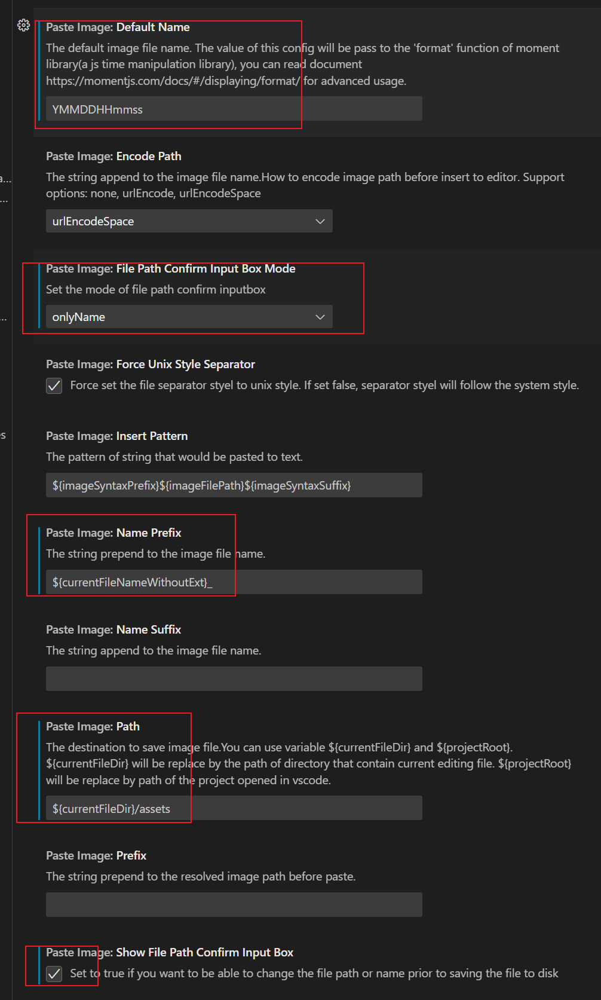

# MarkDown
* extensions search Markdown. I choice the most used plugin "Markdown All in One", you can install which you want.
* you can start write your document and remember to set the file extend with ".md"
* you can open preview at the upper right corner

# Paste Image
This plugin can let's paste image to .md document quickly.
+ search and install "Paste Image"
+ configure the plugin
  + Default Name: use the moment.js so will generate the text accroding to time.
  + Show File Path Confirm Input Box: can let's change the path when paste image.
  + File Path Confirm Input Box Mode: choice "onlyName" we only need to change the image name when the confirm box is pop-up.
  + NamePrefix: we can set this to split the image with different documents. `${currentFileNameWithoutExt}` is the file name which document we want to paste into.
  + Path: The image will pasted path and the url part in md. (Suggestion: add `/assets` folder)
