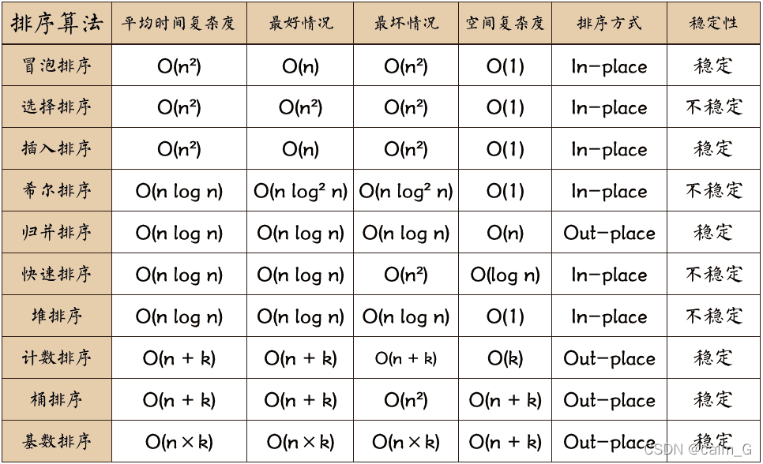
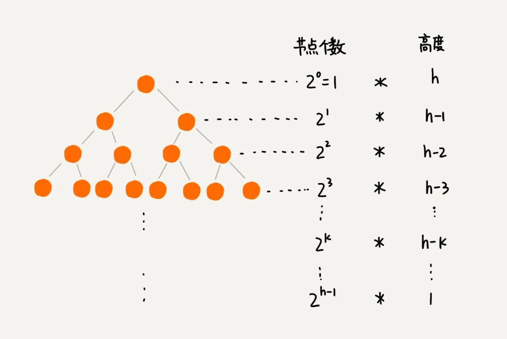

- [Over view of Sort](#over-view-of-sort)
  - [Bubble sort](#bubble-sort)
    - [Time and space complexity](#time-and-space-complexity)
    - [Template Code](#template-code)
  - [Selection sort](#selection-sort)
    - [Time and space complexity](#time-and-space-complexity-1)
    - [Template Code](#template-code-1)
  - [Insertion sort](#insertion-sort)
    - [Time and space complexity](#time-and-space-complexity-2)
    - [Template Code](#template-code-2)
  - [Shell sort](#shell-sort)
    - [Time and space complexity](#time-and-space-complexity-3)
    - [Template Code](#template-code-3)
  - [Merge sort](#merge-sort)
    - [Time and space complexity](#time-and-space-complexity-4)
    - [Template Code](#template-code-4)
  - [Quick sort](#quick-sort)
    - [Time and space complexity](#time-and-space-complexity-5)
    - [Template Code](#template-code-5)
  - [Heap sort](#heap-sort)
    - [Time and space complexity](#time-and-space-complexity-6)
    - [Template Code](#template-code-6)
  - [Count sort](#count-sort)
    - [Time and space complexity](#time-and-space-complexity-7)
    - [Template Code](#template-code-7)
  - [Bucket sort](#bucket-sort)
    - [Time and space complexity](#time-and-space-complexity-8)
  - [Base sort](#base-sort)

# Over view of Sort

> Stable means that we can keep the original relative order of the equal elements after sorting.  
> https://blog.csdn.net/qq_51664685/article/details/124427443
## Bubble sort

1. Compare the adjacent two element[i - 1, 1], if the nums[i - 1] > nums[i], then swap them.
2. We compare all of the adjacent number pair. Until we don't need to swap.
3. Because of swap may move the [4, 8, 3] to [4, 3, 8]. So, we need to loop to ensure after swap the [i, i + 1] are also order.
4. In fact, the kth largest number will be moved to the correct position in k times. So, we only need to loop nums.length times. If no swap is needed, we can skip out.

### Time and space complexity
We suppose the array length is n.
Time : O(n ^ 2)
Space: O(1)

### Template Code
```java
    public static void BubbleSort(int[] nums) {
        // we max need to loop nums.length times
        for (int i = 0; i < nums.length; i++) {
            int swapCount = 0;
            // in each loop we only change the adjacent pair. In fact the max value will move to the end in first time.
            for (int j = 1; j < nums.length; j++) {
                if (nums[j - 1] > nums[j]) {
                    swap(nums, j - 1, j);
                    swapCount++;
                }
            }
            //  If no swap is needed, the array is ordered.
            if (swapCount == 0) {
                break;
            }
        }
    }

    public static void swap(int[] nums, int i, int j) {
        nums[i] ^= nums[j]; // i1 = i ^ j
        nums[j] ^= nums[i]; // j1 = j ^ i1 = j ^ i ^ j = i
        nums[i] ^= nums[j]; // i2 = i1 ^ j1 = i ^ j ^ i = j
    }

```
## Selection sort
1. First, find the smallest (largest) element in the unsorted sequence and store it to the beginning of the sorted sequence.
2. Then continue to find the smallest (large) element from the remaining unsorted elements and put it at the end of the sorted sequence.
3. Repeat the second step until all elements are sorted.
> not stable example: [<font color="red">**2**</font>, 3, 2, 1, 4] -> [1, 3, 2, <font color="red">**2**</font>, 4]


### Time and space complexity
We suppose the array length is n.
Time : O(n ^ 2)
Space: O(1)

### Template Code
```java
    public static void selectionSort(int[] nums) {
        for (int i = 0; i < nums.length - 1; i++) {
            int minimumIndex = i;
            for (int j = i + 1; j < nums.length; j++) {
                if (nums[minimumIndex] > nums[j]) {
                    minimumIndex = j;
                }
            }
            if (minimumIndex > i)
                swap(nums, i, minimumIndex);
        }
    }

    public static void swap(int[] nums, int i, int j) {
        nums[i] ^= nums[j]; // i1 = i ^ j
        nums[j] ^= nums[i]; // j1 = j ^ i1 = j ^ i ^ j = i
        nums[i] ^= nums[j]; // i2 = i1 ^ j1 = i ^ j ^ i = j
    }

```

## Insertion sort
1. start with the first element, which can be considered to have been sorted;

2. taking out the next element and scanning from backwards to forwards in the sequence of already sorted elements;

3. if the element (already sorted) is larger than the new element, move the element to the next position;

4. repeating step 3 until a position is found where the sorted element is less than or equal to the new element;

5. inserting the new element after that position;

6. Repeat steps 2~5.

### Time and space complexity
We suppose the array length is n.
Time : O(n ^ 2)
Space: O(1)

### Template Code
```java
    public static void InsertionSort(int[] nums) {
        for (int i = 1; i < nums.length; i++) {
            int key = nums[i];
            int j = i - 1;
            for (; j >= 0 && nums[j] > key; j--) {
                nums[j + 1] = nums[j];
            }
            nums[j + 1] = key;
        }
    }
```

## Shell sort
The sequence of records to be sorted is first divided into several sub-sequences, and then the entire sequence is sorted by direct insertion when the records in the sequence are "basically ordered". The time complexity of this algorithm is O(n log n).

1. select an incremental sequence t1, t2, ......, tk, where ti > tj, tk = 1;

2. sort the sequence k times by the number of incremental sequences k;

3. For each sort, according to the corresponding increment ti, the sequence to be sorted is partitioned into a number of subsequences of length m, and each subsequences is sorted by direct insertion respectively. When the increment factor is 1, the whole sequence can be sorted.


### Time and space complexity
We suppose the array length is n.
Time : O(n * log n)
> Actually each increment step will scan array once. And the increment is divide k every time, So we will loop (log n) times;
Space: O(1)

### Template Code
```java
    public static void shellSort(int[] nums) {
        int increment = nums.length;
        // execute al least once
        do {
            // 3 is up to you, + 1 is ensure we can sorted the array.
            increment = increment / 3 + 1;
            // start from [0, increment - 1]
            for (int i = 0; i < increment; i++) {
                // Insertion Sort subsequence
                for (int j = i + increment; j < nums.length; j += increment) {
                    int key = nums[j];
                    int k = j;
                    while (k > i && nums[k] < nums[k - increment]) {
                        nums[k] = nums[k - increment];
                        k -= increment;
                    }
                    if (k != j) {
                        nums[k] = key;
                    }
                }
            }
        }
        while (increment > 1);
    }
```


## Merge sort
To divide and conquer, we will split the array into two sub-arrays. Then sort them separate and finally merge them.

1. dividing the input sequence of length n into two subsequences of length n/2;

2. sort each of these two subsequences separate;

3. merge the two sorted subsequences into a final sorted sequence.

### Time and space complexity
We suppose the array length is n.
Time : O(n * log n)
> mergeSortedSequence need O(n). We will split log n times. So n * log n
Space: O(n) we need a temporary array

### Template Code
```java
    public static void mergeSort(int[] nums, int start, int end) {
        if (start >= end) {
            return;
        }
        int mid = (end - start) / 2 + start;
        mergeSort(nums, start, mid);
        mergeSort(nums, mid + 1, end);
        mergeSortedSequence(nums, start, mid, mid + 1, end);
    }

    private static void mergeSortedSequence(int[] nums, int start1, int end1, int start2, int end2) {
        int start = start1;
        int end = end2;
        int[] temporary = new int[end - start + 1];
        int top = 0;
        while (start1 <= end1 && start2 <= end2) {
            if (nums[start1] <= nums[start2]) {
                temporary[top++] = nums[start1++];
            } else {
                temporary[top++] = nums[start2++];
            }
        }

        while (start1 <= end1) {
            temporary[top++] = nums[start1++];
        }

        while (start2 <= end2) {
            temporary[top++] = nums[start2++];
        }

        for (int i = start; i <= end; i++) {
            nums[i] = temporary[i - start];
        }
    }
```


## Quick sort
We select a number then split the array to two parts. The left is less than the number, the right is greate then the number.
Dividing and conquer this sequence.

1. Pick an element from the series, called the "benchmark".

2. Reorder the series so that all elements smaller than the benchmark value are placed in front of the benchmark, and all elements larger than the benchmark value are placed behind the benchmark (the same number can go to either side). After this partition is exited, the benchmark is in the middle of the series. This is called a partition operation;

3. recursively sorts the subseries of elements smaller than the base and the subseries of elements larger than the base.


### Time and space complexity
We suppose the array length is n.
Time : O(n * log n)
> mergeSortedSequence need O(n). We will split log n times. So n * log n
Space: O(n) we need a temporary array

### Template Code
```java
    public static void quickSort(int[] nums, int start, int end) {
        if (start >= end) {
            return;
        }
        
        int partIndex = partition(nums, start, end);
        quickSort(nums, start, partIndex - 1);
        quickSort(nums, partIndex + 1, end);
    }

    private static int partition(int[] nums, int left, int right) {
        int benchmark = nums[left];

        while (left < right) {
            // find the first val less than benchmark from right to left
            while (left < right && nums[right] >= benchmark) {
                right--;
            }
            // this val will replace nums[start]. So, left++;  The nums[right] will be Meaningless and can be replace by the finded greater number.
            if (left < right) {
                nums[left] = nums[right];
                left++;
            }

            // find the first val greater than benchmark from left to right
            while (left < right && nums[left] <= benchmark) {
                left++;
            }
            // this left will fill the last right position
            if (left < right) {
                nums[right] = nums[left];
                right--;
            }
        }
        // the lastest left has been give right. So, we can place the benchmark here.
        nums[left] = benchmark;
        return left;
    }

```

## Heap sort
A heap is a structure that approximates a complete binary tree and satisfies both the properties of a heap: The key or index of a child node is always less (or greater) than or equal its parent node.

[heap detail](../Heap.md)

1. bulid heap start from nums[len / 2] to nums[0];
> [len / 2 + 1, len - 1] is leaf node, so don't need to swap with children.   
> parent node i: left child i * 2 + 1, right child i * 2 + 2;  so node[len / 2] left child is len / 2 * 2 + 1   
> if len is odd len / 2 * 2 = len - 1 ==> len / 2 * 2 + 1  = len
> if len is even len / 2 * 2 = len ==> len / 2 * 2 + 1  = len + 1 
> So len / 2 is absolute leaf node.
1. sort 
   1. swap the non-sorted last node and the non-sorted top node.
   2. re-heapify the heap move the new top node to correct position.
> non-sorted last is the separation line with sorted sequence. The top node is the largest or smallest. We move top node to this position to extensive the sorted sequence.

### Time and space complexity
We suppose the array length is n.  
Time: O(n) + O(n * log n) ==> O(n * log n)
1. O(n) build Heap 
2. sort every node approximate log n So n * log n



> s1 = 1 * h + 2^1 * (h - 1) ... + 2^(h - 1) * 1  
> s2 = s1 * 2 = 2 ^ 1 * h + 2^2 * (h - 1) ... + 2^(h - 1) * 2 + 2^h * 1  
> s2 - s1 = <font color="red">2^h + 2^(h-1) +... + 2^1</font> - h = s1  
> this is a Proportional sequence  
> sum = 2 * (1-2^h)/(1-2) = 2 * (2^h - 1);  
> s1 = 2^(h + 1) - 2 -h;    
> h = log 2 n
> s1 2 * O(n) - 2 - h  ==> O(n)  

Space: O(n) 

### Template Code
```java
public static void heapSort(int[] nums) {
        buildHeap(nums);
        int k = nums.length - 1;
        while (k > 0) {
          swap(nums, 0, k);
          --k;
          heapify(nums, k, 0);
        }
      }
      
      // heapify
      private static void buildHeap(int[] nums) {
        for (int i = nums.length / 2; i >= 0; --i) {
          heapify(nums, nums.length - 1, i);
        }
      }
      
      /*
       * nums is the array
       * n is the end index
       * i is the start heapify index
       */
      private static void heapify(int[] nums, int n, int i) {
        while (true) {
          int maxPos = i;
          // 
          if (i * 2 + 1 <= n && nums[i] < nums[i * 2 + 1]) maxPos = i * 2 + 1;
          if (i * 2 + 2 <= n && nums[maxPos] < nums[i * 2 + 2]) maxPos = i * 2 + 2;
          if (maxPos == i) break;
          swap(nums, i, maxPos);
          i = maxPos;
        }
      }

    private static void swap(int[] nums, int i, int j) {
        nums[i] ^= nums[j]; // i1 = i ^ j
        nums[j] ^= nums[i]; // j1 = j ^ i1 = j ^ i ^ j = i
        nums[i] ^= nums[j]; // i2 = i1 ^ j1 = i ^ j ^ i = j
    }
```

## Count sort
Convert the input data values into keys to be stored in the additional array space opened.

1. find out the array minmum and maximum, generate a array [minimum, maximum] (or [0, maximum - minimum])
2. fill the additional array store the val appear counts.
3. loop the store array and output the index nums[index] times to an answer array. 


### Time and space complexity
We suppose the array length is n and the [0, maximum - minimum] length is k.
Time: O(n + k)
Space: O(k) 


### Template Code
```java
    public static void countSort(int[] nums) {
        int min = Arrays.stream(nums).min().orElse(0);
        int max = Arrays.stream(nums).max().orElse(0);
        int[] arr = new int[max - min + 1];
        Arrays.stream(nums).forEach(e -> arr[e - min]++);
        int top = 0;
        for (int i = 0; i < arr.length; i++) {
            while (i < arr.length && arr[i] > 0) {
                nums[top++] = i + min;
                i++;
            }
        }
    }
```

## Bucket sort
Same as Count sort, but bucket is range, each bucket has many data.We neet to sort the data in each bucket separately. Then we only need to merge the each bucket. And the bucket has order, so we only combine them direct.

### Time and space complexity
We suppose the array length is n and the [0, maximum - minimum] length is k.
Time: O(n + k)
Space: O(k) 

## Base sort