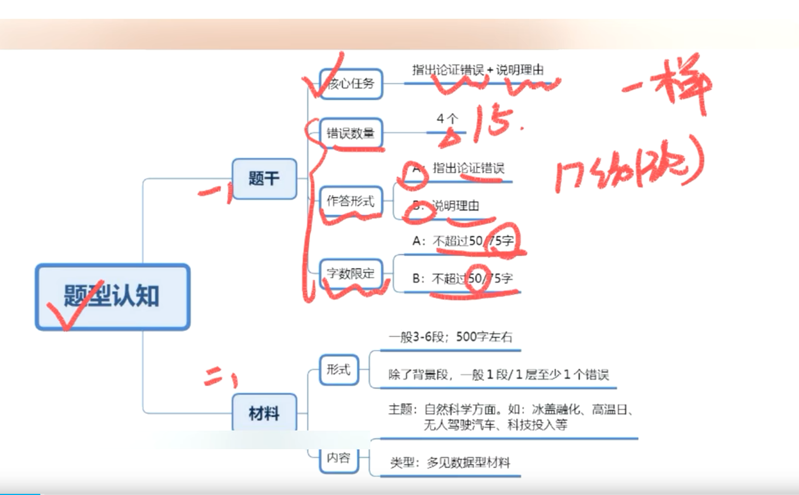
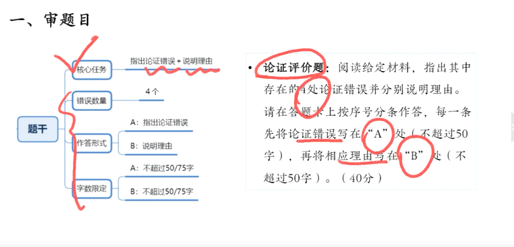
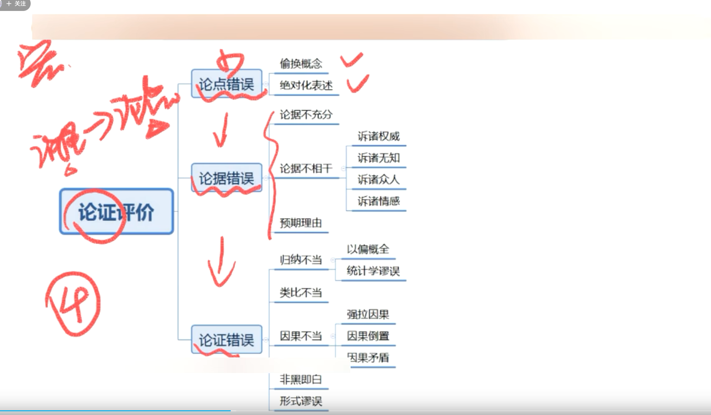
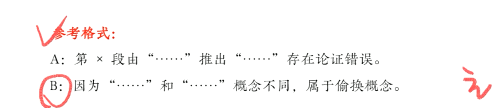
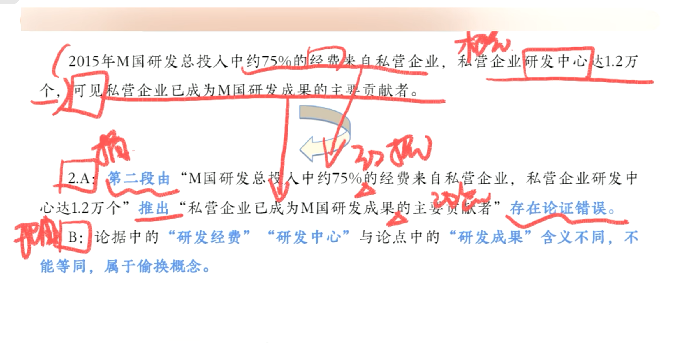

# 事业单位
## video
https://www.bilibili.com/video/BV1sY411B79p/?share_source=copy_web&vd_source=92f13df76028caacb91e47e21fcf1a2f
# 综合应用A

## 论证评价
**什么是论证:** 用一个或一些真实的命题确定另一个命题真实性的思维形式 
> 例子：天才来着域勤奋。 爱迪生为了发明电灯，阅读了大令资料，光笔记就有四万多页，才实现伟大发明。

**论证3要素:** 论点，论据，论证方式
1. 论点： 作者所表达的观点，主张，结论等
2. 论据：用来证明论点的依据
3. 论证方式： 用来证明论点的方法（思维形式）

### 解题思路
1. 审题目
   > 
2. 读文段
   1. 明确论点和论据
      1. 论点
         * 提示词：建议，认为，所以，因此，可见，表明等
         * 首尾句原则。
      2. 论据
         * 提示词：由于，因为，例如，鉴于，理由是，根据，依据等
         * 材料内容：例子，数据等
   2. 分析论证错误
   > 
3. 写答案
 > 
 > 
 论据中和论点中的这几个词可以省略，其他几个是得分点
