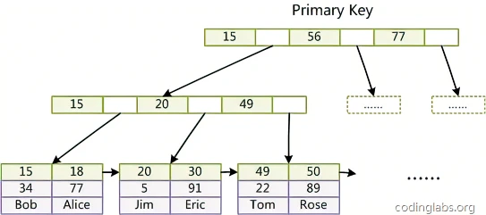
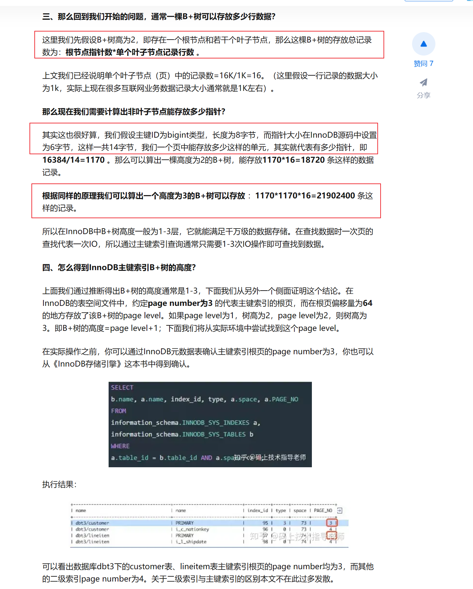

# Mysql

## reference
1. http://mysql.taobao.org/monthly/2015/05/01/  
2. http://blog.codinglabs.org/articles/theory-of-mysql-index.html  

## MysqlIndex
http://blog.codinglabs.org/articles/theory-of-mysql-index.html  
keyValue = emploeeNo+depart = ac
|emploeeNo|name|depart|
|---|---|---|
|a|b|c

we can use explain to view the engine execute plan   

那么我们可以计算索引文件的大小，root 16K，有1170个节点 ，每个节点有1170个子节点。
1 （root）+ 1170  （level1）+ 1170*1170 （level2） = 1370071 页
1370071 * 16 K = 21921136 k = 21407.359375 M = 20.9056 GB

