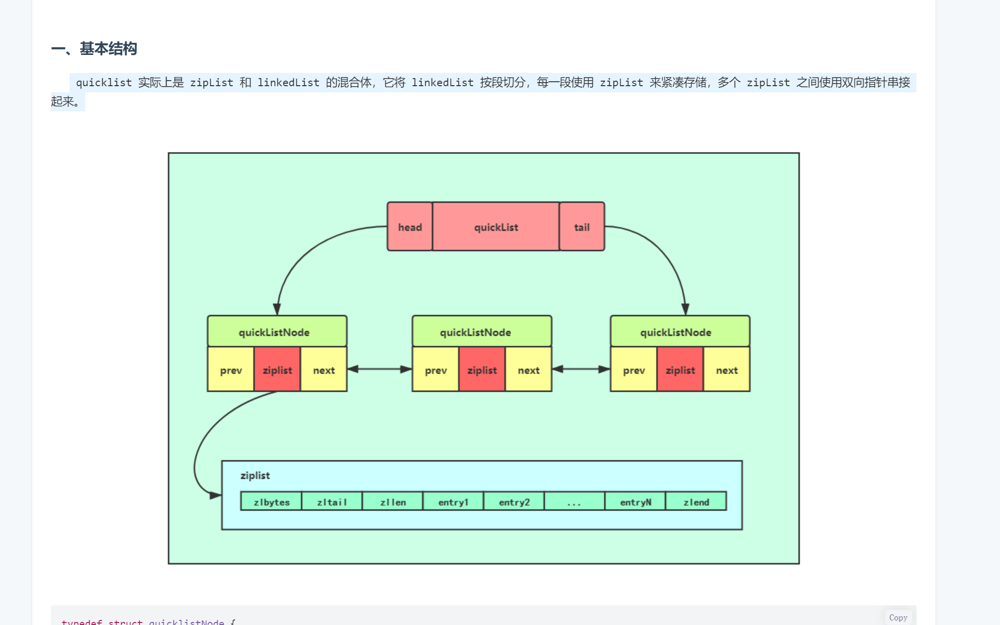

# Redis
## resource
[官网](https://redis.io/docs/data-types/)  
[9种数据结构](https://juejin.cn/post/7108920755592626207)
[结构实现](https://www.cnblogs.com/hunternet/p/9989771.html)

## data structure
> 7.0 后ziplist -> listpack
1. String
   > A value can't be bigger than 512 MB.
2. Hash
   > 1. ziplist: 元素<512个且在元素大小<64kb   7.0后抛弃ziplist只用listpack
   > 2. hashtable
3. List
   > The max length of a Redis list is 2^32 - 1 (4,294,967,295) elements.
   > 1. ziplist： 个数少于512，值大小<64kb 都可配置
   > 2. linkedlist
   > 3.2 后就只用quicklist
4. Set
   > The max size of a Redis set is 2^32 - 1 (4,294,967,295) members.
   > 1. intset
   > 2. hashtable
5. Zset
   > 1. ziplist: 元素小于128个且元素大小< 64kb     
   > 2. skiplist
6. Geo 位置经纬度
   > zset 存储，利用score去存储象关性
7. HyperLogLog
   > 基数统计就是指统计一个集合中不重复的元素个数。 有误差
8. Bitmaps
   > value 只有0,1 用bit[] 去记录数据，空间小
   > 例如1签到等
9.  Stream
    >Redis 专门为消息队列设计的数据类型。

## quicklist

1. prev: 指向链表前一个节点的指针。 
2. next: 指向链表后一个节点的指针。
3. zl: 数据指针。如果当前节点的数据没有压缩，那么它指向一个ziplist结构；否则，它指向一个quicklistLZF结构。
4. sz: 表示zl指向的ziplist的总大小（包括zlbytes, zltail, zllen, zlend和各个数据项）。需要注意的是：如果ziplist被压缩了，那么这个sz的值仍然是压缩前的ziplist大小。
5. count: 表示ziplist里面包含的数据项个数。这个字段只有16bit。稍后我们会一起计算一下这16bit是否够用。
6. encoding: 表示ziplist是否压缩了（以及用了哪个压缩算法）。目前只有两种取值：2表示被压缩了（而且用的是LZF压缩算法），1表示没有压缩。
7. container: 是一个预留字段。本来设计是用来表明一个quicklist节点下面是直接存数据，还是使用ziplist存数据，或者用其它的结构来存数据（用作一个数据容器，所以叫container）。但是，在目前的实现中，这个值是一个固定的值2，表示使用ziplist作为数据容器。
8. recompress: 当我们使用类似lindex这样的命令查看了某一项本来压缩的数据时，需要把数据暂时解压，这时就设置recompress=1做一个标记，等有机会再把数据重新压缩。
9. attempted_compress: 这个值只对Redis的自动化测试程序有用。我们不用管它。
10. extra: 其它扩展字段。目前Redis的实现里1也没用上。