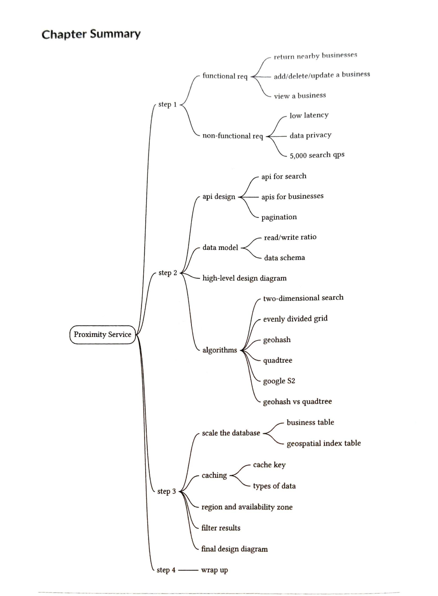
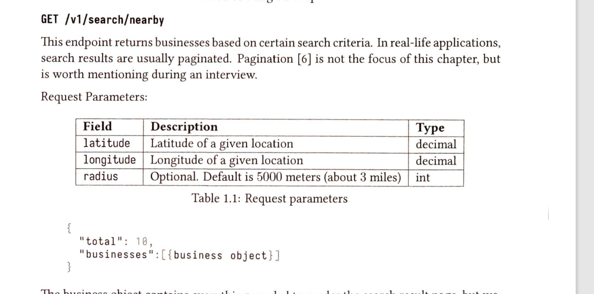
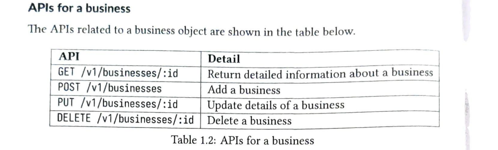
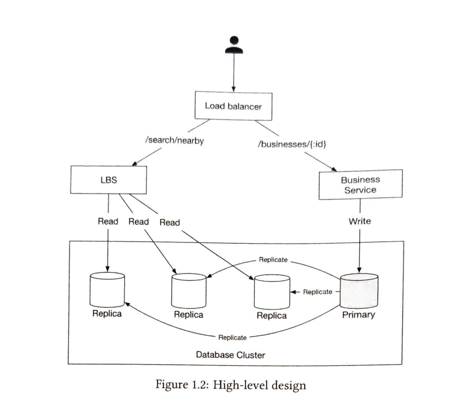
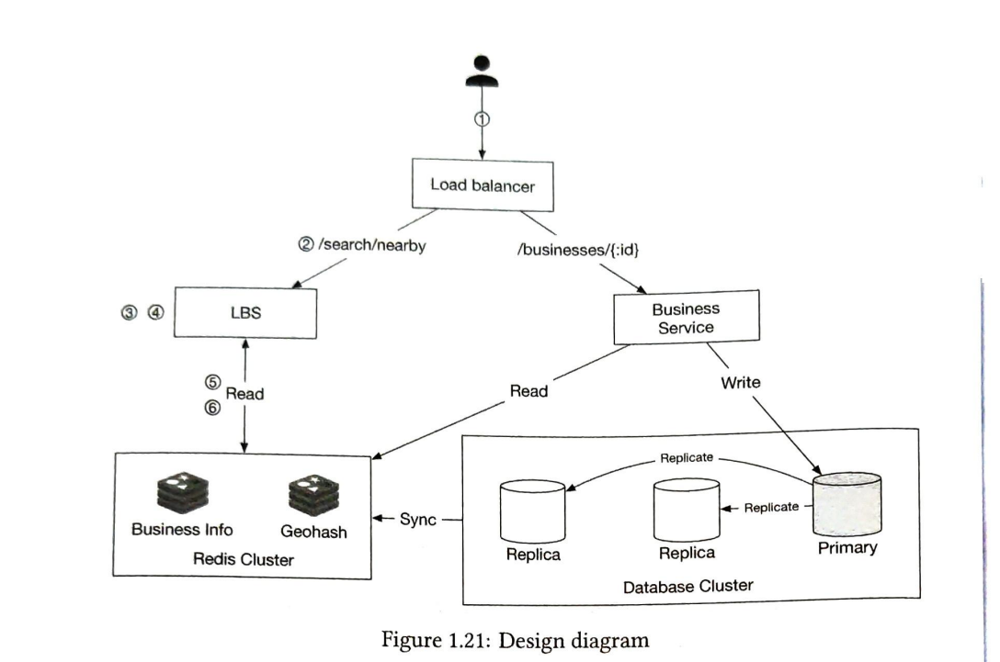

# The system design Template
## resource
1. DDIA https://github.com/Vonng/ddia/blob/master/ch1.md
2. ByteByteGo https://www.bilibili.com/video/BV1yt4y137cN/?p=2&spm_id_from=pageDriver&vd_source=8219a456a0a1ae8bf8ba879baafaccf8

## Step1 - Understand the problem and establish Design Scope
了解问题并确定设计范围

问问题确定需要设计的功能和一些异常情况。
1. 确定要实现的功能
2. 考虑低延迟，数据隐私，高可用，高扩展等

## Step2 - Propose High-level Design and Get buy-in
提出总体的设计并获得认同
例如一些定位服务
### 1. API design
   
   

### 2. Data model
#### 2.1 Read/write ratio
考虑读写比率选择对应的数据库
#### 2.2 Data Schema
1. business schema
2. geo index table

### 3. High-level design

1. load balance  负载均衡
2. 拆分需要的服务
   1. location-based-service (LBS)  
   2. Business-service 拆分需要的服务
3. Database cluster 高可用下数据库的主从架构
4. Scalability of business and LBS 可伸缩的分布式

### 4. Algorithm to find nearby businesses
算法的大致原理和业务的取舍。
比如新加入的商店在一天后才有效，这种可以应对数据延迟。
计算内存数据需要的空间，进行划分等等

## Step 3 - Design Deep Dive
1. Scale the database
   1. shard the relation database's table
   2. replica the geospatial index
2. Caching
   1. 是否需要缓存
      1. 数据容量小，容易存储，读取速度快
      2. 读多于写，提升吞吐量
   2. Cache Key 缓存的结构设计，具体用什么当做缓存
3. Region and Availability zones
   1. physical closer deploy 物理上近距离部署
   2. separate deploy when population(requests) density 当人口(请求) 密集的地区最好独立部署并且保证高可用
   3. privacy laws 隐私要求可能要当地国家部署一个
4. Filter results by time or business type
   1. data is small so，can filter in the service
5. final architecture diagram

## Step 4 - Wrap Up

