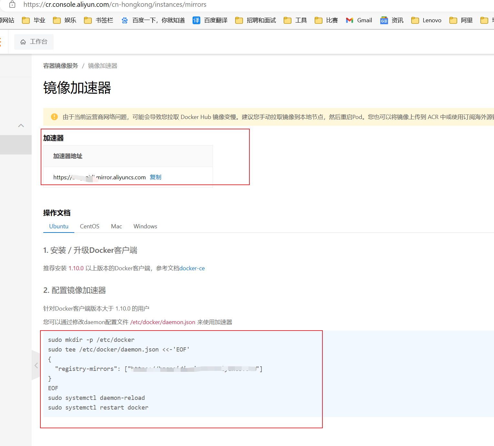

# Docker
## install and uninstall engine
https://docs.docker.com/engine/install/ubuntu/

### Install using the apt repository

#### Set up the repository
```shell
# 1. Update the apt package index and install packages to allow apt to use a repository over HTTPS:
sudo apt-get update

sudo apt-get install ca-certificates curl gnupg

# 2. Add Docker’s official GPG key:
sudo install -m 0755 -d /etc/apt/keyrings

curl -fsSL https://download.docker.com/linux/ubuntu/gpg | sudo gpg --dearmor -o /etc/apt/keyrings/docker.gpg

sudo chmod a+r /etc/apt/keyrings/docker.gpg

# 3. Use the following command to set up the repository:
echo \
  "deb [arch="$(dpkg --print-architecture)" signed-by=/etc/apt/keyrings/docker.gpg] https://download.docker.com/linux/ubuntu \
  "$(. /etc/os-release && echo "$VERSION_CODENAME")" stable" | \
  sudo tee /etc/apt/sources.list.d/docker.list > /dev/null
```
#### Install Docker Engine

```Shell
# 1. sudo apt-get update
sudo apt-get update

# 2. Install Docker Engine, containerd, and Docker Compose. To install the latest version, run:
sudo apt-get install docker-ce docker-ce-cli containerd.io docker-buildx-plugin docker-compose-plugin

# 3. Verify that the Docker Engine installation is successful by running the hello-world image.

sudo docker run hello-world
```

```shell
sudo apt-get purge docker-ce docker-ce-cli containerd.io docker-buildx-plugin docker-compose-plugin docker-ce-rootless-extras
```

## configure the mirror 
use aliyun
https://cr.console.aliyun.com/cn-hongkong/instances/mirrors

```shell
sudo mkdir -p /etc/docker

sudo tee /etc/docker/daemon.json <<-'EOF'
{
  "registry-mirrors": ["https://bzqpoidi.mirror.aliyuncs.com"]
}
EOF

sudo systemctl daemon-reload

sudo systemctl restart docker
```
