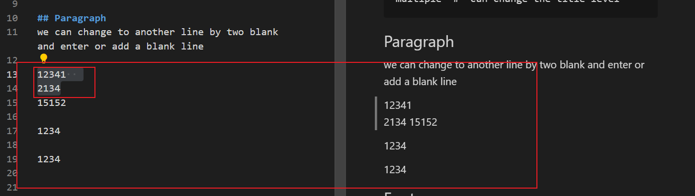
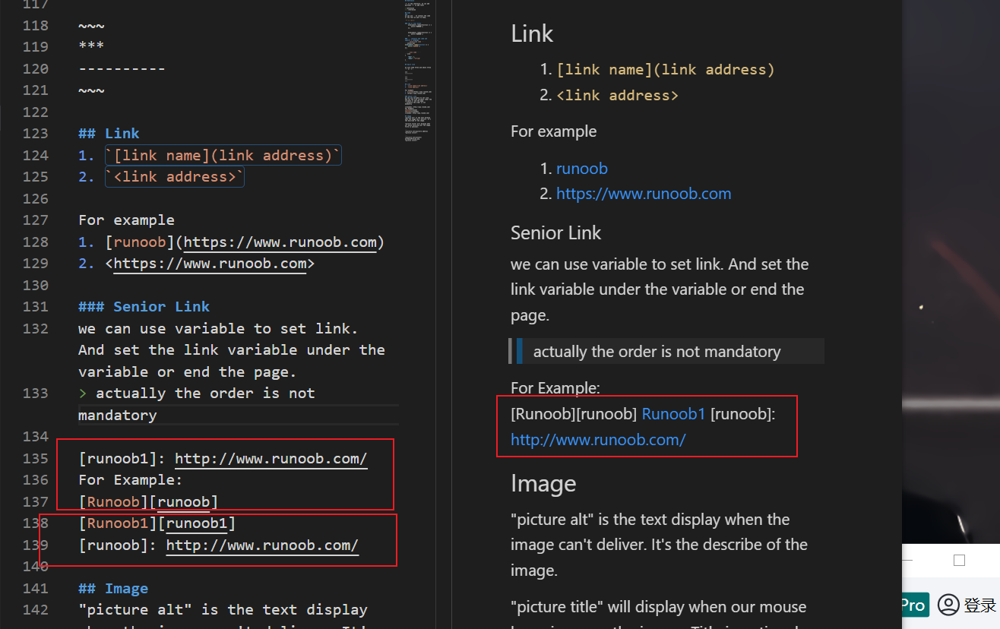

# Syntax

## Title
```
# is the title 
## is second level title
multiple '#' can change the title level
```

## Paragraph
we can change to another line by two blank and enter or add a blank line 

12341  
2134
15152

1234

1234




## Font

### Bold
**This is bold text**

### Italic
*This is italic text*  
_italic_

### Italic and bold 
***This is italic and bold text***

### Strikeout
~~This is text with strikeout~~
```
**This is bold text**
*his is italic text*
***This is italic and bold text***
~~This is text with strikeout~~
```
## List
### UnOrder list
we can start with '*', '+' or '-' + blank
* 1
- 2
+ 3
```
* 1
- 2
+ 3
```

### Order list
we need start with a number and a dot.  
Please notice that the num you set is not the really number.
1. 1
2. 2
4. 4
1. 1
2. 2
```
1. 1
2. 2
4. 4
1. 1
2. 2
```

## Reference

'>' is the reference, we can add multiple '>' to add level

> reference1
> > reference2

## Code
### ``
we can use `` to contain the code or the text we want to keep.

`"" > > ** *`

### Tab or four blank
    $(document).ready(function () {
        alert('RUNOOB');
    });
    

    $(document).ready(function () {
        alert('RUNOOB');
    });

### ``` contains the code and appoint a language
 ` ```javascript code ``` `
```javascript
$(document).ready(function () {
    alert('RUNOOB');
});
```

 ` ```json code ``` `
```json
{   
    "key": 1, 
    "key1": "string"
}
```

## Split line

we just need three and above three '-' or '*'.

***
----------

~~~
***
----------
~~~

## Link
1. `[link name](link address)`
2. `<link address>`
   
For example 
1. [runoob](https://www.runoob.com)
2. <https://www.runoob.com>

### Senior Link
we can use variable to set link. And set the link variable under the variable or end the page.
> actually the order is not mandatory

[runoob1]: http://www.runoob.com/
For Example:  
[Runoob][runoob]
[Runoob1][runoob1]
[runoob]: http://www.runoob.com/


## Image
"picture alt" is the text display when the image can't deliver. It's the describe of the image.

"picture title" will display when our mouse hovering over the image. Title is optional.

```


```


## Table
|  titleLeftAlign   | titleRightAlign  | titleCentralAlign
|  :----  | ----:  |:----:|
| cell  | cell | cell |
| cell  | cell | cell |

```
|  titleLeftAlign   | titleRightAlign  | titleCentralAlign
|  :----  | ----:  |:----:|
| cell  | cell | cell |
| cell  | cell | cell |
```

## Html
You can try to add html element. Maybe will support.

## Transferred meaning
Because of the md use many special character to indicate special meaning.

We can use '\\' to display these character direct.

**bold**   
\*\* bold \*\*
~~~
**bold**   
\*\* bold \*\*
~~~