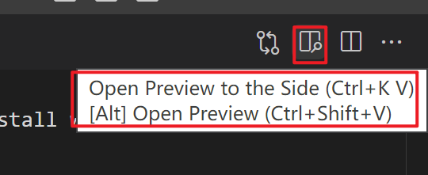

* extensions search Markdown. I choice the most used plugin "Markdown All in One", you can install which you want.
* you can start write your document and remember to set the file extend with ".md"
* you can open preview at the upper right corner
