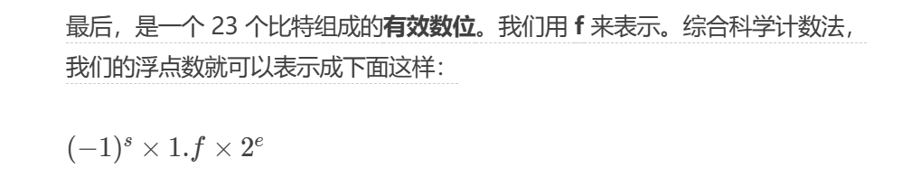
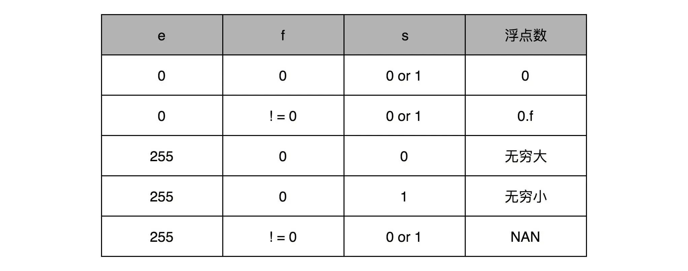
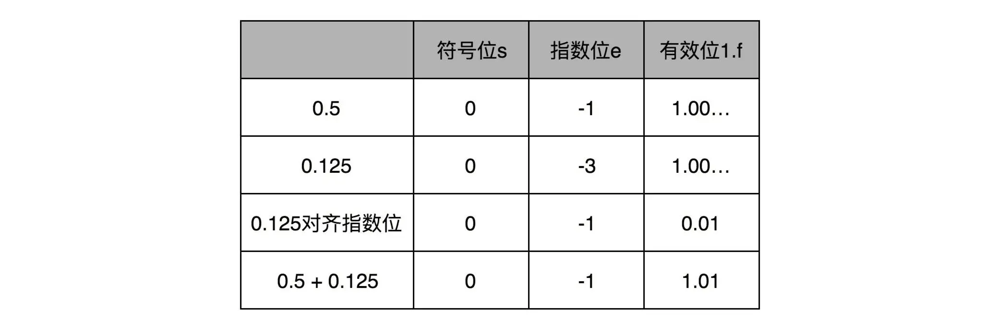

# Binary

## 机器数
一个数在计算机中的二进制表示形式，叫做这个数的机器数。机器数是带符号的，在计算机用机器数的最高位存放符号，正数为0，负数为1。

## 真值
因为第一位是符号位，所以机器数的形式值就不等于真正的数值。所以，为区别起见，将带符号位的机器数对应的真正数值称为机器数的真值。


## 原码
符号会加上真值的绝对值
```
[+1]原= 0000 0001

[-1]原= 1000 0001
```


## 反码
正数的反码是其本身；

负数的反码是在其原码的基础上，符号位不变，其余各个位取反。
```
[+1] = [0000 0001]原= [0000 0001]反

[-1] = [1000 0001]原= [1111 1110]反
```

## 补码
正数的补码就是其本身；

负数的补码是在其原码的基础上，符号位不变，其余各位取反，最后+1。(也即在反码的基础上+1)
> 补码解决了反码 0000 和1000 的两个0的问题  
> 而且参与运算多一个[-128, 127] -128
> 当然更重要的一点是，用补码来表示负数，使得我们的整数相加变得很容易，不需要做任何特殊处理，只是把它当成普通的二进制相加，就能得到正确的结果。
```
[+1] = [0000 0001]原= [0000 0001]反= [0000 0001]补

[-1] = [1000 0001]原= [1111 1110]反= [1111 1111]补

补码也参与运算就和加法没什么区别了
-1 * 2^7 + 1 * 2^6 + 1 * 2^5 + 1 * 2^4 +
1 * 2^3 + 1 * 2 ^ 2 + 1 * 2 ^ 1 + 1 * 2 ^0
```


## 定点数和浮点数
定点数，我们把某一个比如2位之后的当小数


浮点数
1. 单精度



> e : 0~255(这里的指数不算符号位) 1 ~ 254 映射 -126 ~ 127。 <font color="red">0 和255用于特殊场景</font>
>
>


### 浮点数的加法和精度损失
先对齐再计算
A，B 的指数为可能不一样，这样就要把较小的指数变成较大的指数。这里小的那个数的有效位置就丢失了
   

记录每次丢失的精度直到不会丢失在加上。用减法保存每次+y 后 丢失的值
sum + y - sum - y 这样  
大数sum会减掉，差别就只剩y被忽略的掉部分
https://en.wikipedia.org/wiki/Kahan_summation_algorithm