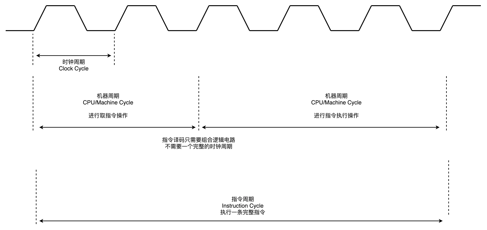
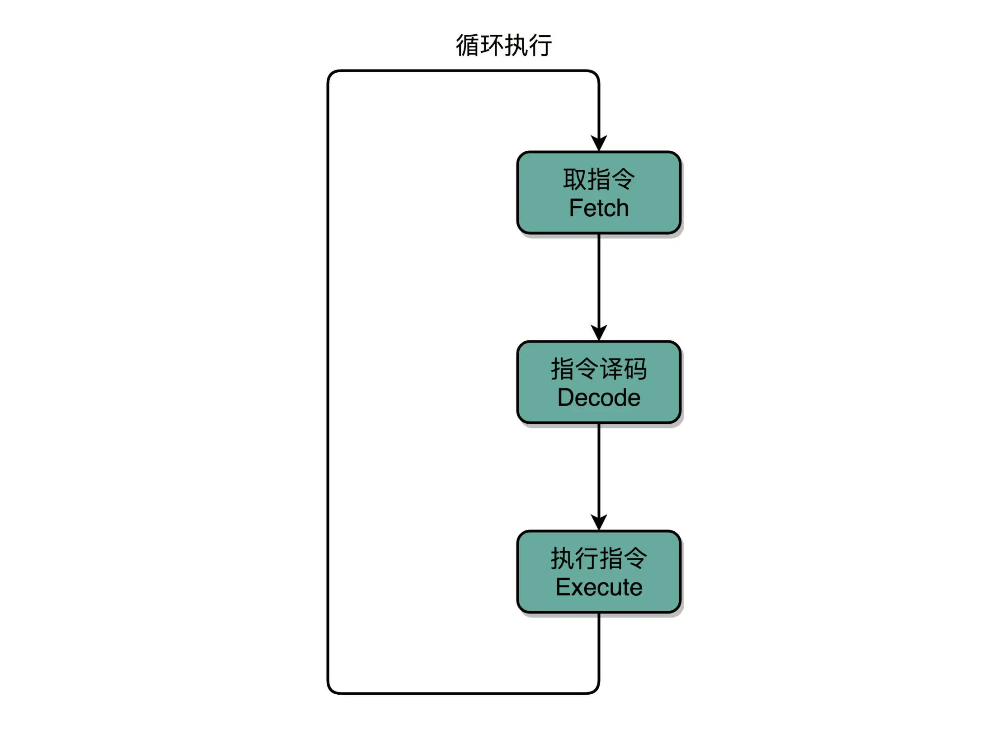
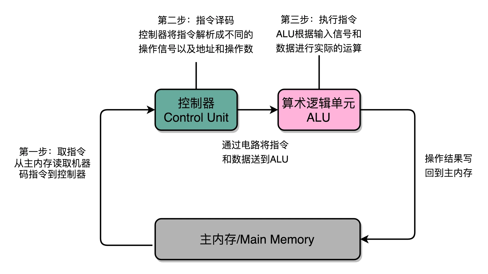
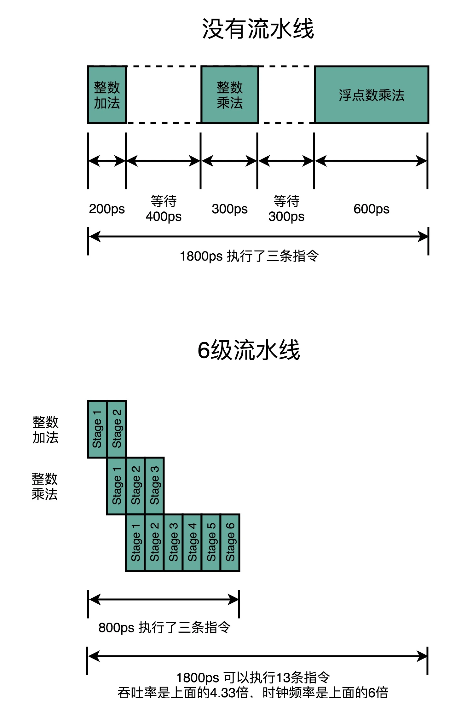
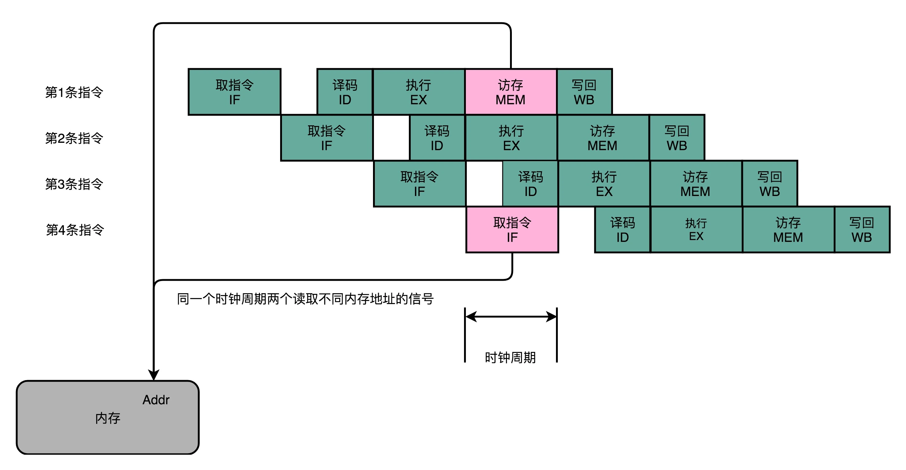
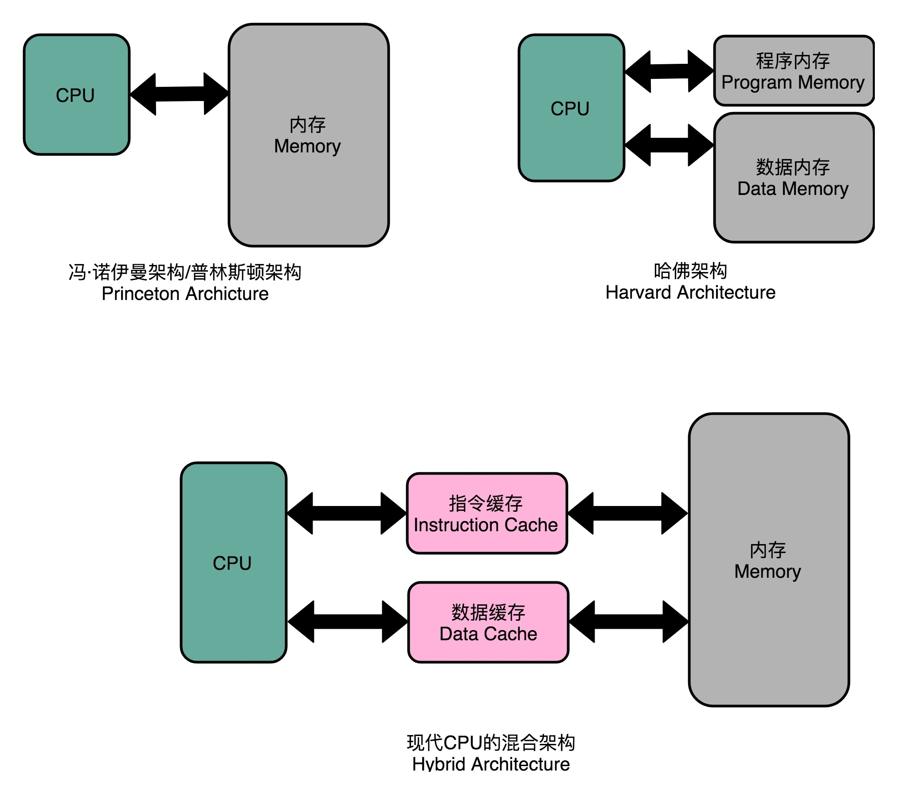
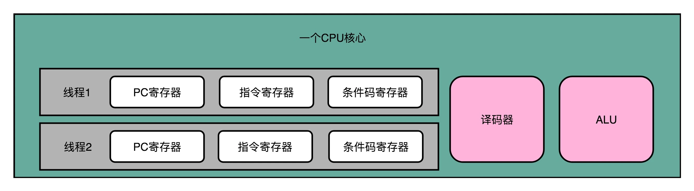
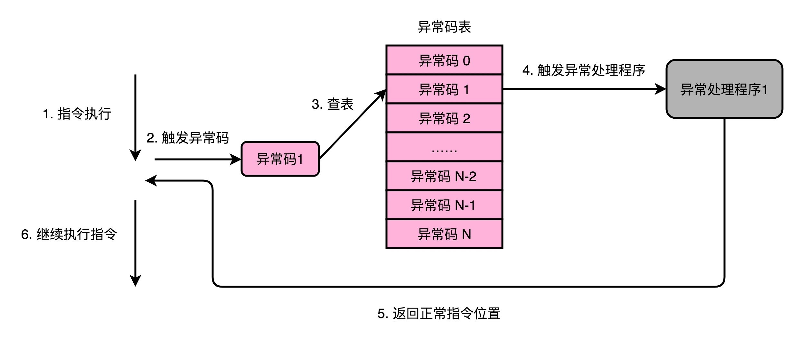
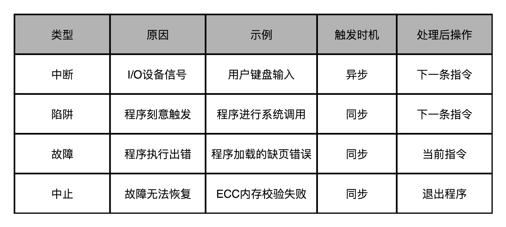

# CPU
指令+计算才是完整的CPU

## 3个周期的关系

1. 一个CPU周期，通常会由几个时钟周期累积起来，一个 CPU 周期的时间，就是这几个 Clock Cycle 的总和。
2. 对于一个指令周期来说，我们取出一条指令，然后执行它，<font color="red">至少需要两个 CPU 周期。取出指令至少需要一个 CPU 周期，执行至少也需要一个 CPU 周期</font>，复杂的指令则需要更多的 CPU 周期。


## 指令周期(instruction Cycle)
1. Fetch (取得)：PC寄存器获取指令加载到指令寄存器，然后PC寄存器自增
2. Decode (指令译码)：解析指令寄存器里的指令
3. Execute (执行指令): 算术逻辑，数据传输和跳转等







## 机器周期或者CPU周期 （Machine Cycle）
CPU内部操作很快，但是访问内存速度慢，每一条指令都需要从内存里面加载而来，所以我们一般把从内存里面读取一条指令的最短时间，称为 CPU 周期。


## Clock Cycle 时钟周期
主频


## 记忆功能
当两个开关都断开的时候最终的输出结果，取决于之前动作的输出结果。
几个

## 流水线
当前好像有14级？

是CPU有时钟周期，一个指令可能拆分成n个时钟周期执行。这样我们就可以缩小主频，提高吞吐量。不用因为要执行最复杂的指令长导致简单的指令也要等待相同时间。

> 时钟周期是指令平均的执行时间  
> 这里是因为周期分成多个stage，实际每个stage执行还是由其他电路去执行的，并不是共用一份资源



## 乱序执行
如果是有依赖关系的，那么我们后一个只能在前一个后面，用不上流水线。这时我们可以通过指令重排列，提高吞吐量

```java
int a = 10 + 5; // 指令1   1个周期
int b = a * 2; // 指令2 2个周期
float c = b * 1.0f; // 指令3 3个周期
int x = 10 + 5; // 指令4 1个周期
int y = a * 2; // 指令5  2个周期
float z = b * 1.0f; // 指令6 3个周期
int o = 10 + 5; // 指令7 1个周期
int p = a * 2; // 指令8 2个周期
float q = b * 1.0f; // 指令9 3个周期
```
先1,4,7-->2,5,8-->3,6,9
```
//不重排序
122333 455666 788999
//每行第一个是stage1，第二个是stage2
1
 4
  7
   22
    55
     88
      333
       666
        999
```


## CPU 高速缓存
借鉴了哈弗架构，把CPU内部的高速缓存部分进行了区分，分成了指令缓存和数据缓存。这样取数据和取指令的资源就不会有竞争了。


<font color="red">这里是因为取指令和取数据在不同的流水线的stage所以会同时执行</font>




## CPU 的冒险和预测
### 结构冒险
本质上是一个硬件层面的资源竞争问题，也就是一个硬件电路层面的问题。
1. 这里可以加资源解决 （CPU高速缓存）
2. 可以停顿让出资源
> CPU 在同一个时钟周期，同时在运行两条计算机指令的不同阶段。但是这两个不同的阶段，可能会用到同样的硬件电路。
> 
> 


### 数据冒险
同时执行的多指令之间有数据依赖的情况，分成3大类
1. 先写后读
2. 先读后写
3. 写后再写

解决这类问题需要通过插入无效的NOP操作解决冒险问题。达到流水线停顿的目的，等待依赖条件满足。


## 超线程
CPU会有双份的 PC 寄存器、指令寄存器乃至条件码寄存器
但是无论是指令译码器还是 ALU，一个 CPU 核心仍然只有一份。
所以是假装同时多线程，类似8核16线程。

> 是在一个线程 A 的指令，在流水线里停顿的时候，让另外一个线程去执行指令。因为这个时候，CPU 的译码器和 ALU 就空出来了，那么另外一个线程 B，就可以拿来干自己需要的事情。这个线程 B 可没有对于线程 A 里面指令的关联和依赖。通过找两个完全不相关的指令，这样就没有冒险的问题存在，同时运行也不会发生冒险。 所以通常是两个进程


## 异常
计算机会为每一种可能会发生的异常，分配一个异常代码（Exception Number）。有些教科书会把异常代码叫作中断向量（Interrupt Vector）。异常发生的时候，通常是 CPU 检测到了一个特殊的信号。比如，你按下键盘上的按键，输入设备就会给 CPU 发一个信号。或者，正在执行的指令发生了加法溢出，同样，我们可以有一个进位溢出的信号。这些信号呢，在组成原理里面，我们一般叫作发生了一个事件（Event）。CPU 在检测到事件的时候，其实也就拿到了对应的异常代码。

### 异常处理逻辑
“保存现场、异常代码查询、异常处理程序调用“


### 异常分类

### 异常的分类-中断
这个打断执行的信号，来自于 CPU 外部的 I/O 设备。你在键盘上按下一个按键，就会对应触发一个相应的信号到达 CPU 里面。CPU 里面某个开关的值发生了变化，也就触发了一个中断类型的异常。
### 异常的分类-陷阱
陷阱，其实是我们程序员“故意“主动触发的异常。就好像你在程序里面打了一个断点，这个断点就是设下的一个"陷阱"。当程序的指令执行到这个位置的时候，就掉到了这个陷阱当中。然后，对应的异常处理程序就会来处理这个"陷阱"当中的猎物。
<font color="red">比如调用系统调用的时候，从程序的用户态到内核态的时候。读取文件，创建进程等因为用户态没权限做所以交给异常处理程序执行</font>

### 异常的分类-故障
故障不是刻意触发的异常。

故障和陷阱、中断的一个重要区别是，故障在异常程序处理完成之后，仍然回来处理当前的指令，而不是去执行程序中的下一条指令。因为当前的指令因为故障的原因并没有成功执行完成。
### 异常的分类-中止
当 CPU 遇到了故障，但是恢复不过来的时候，程序就不得不中止了。