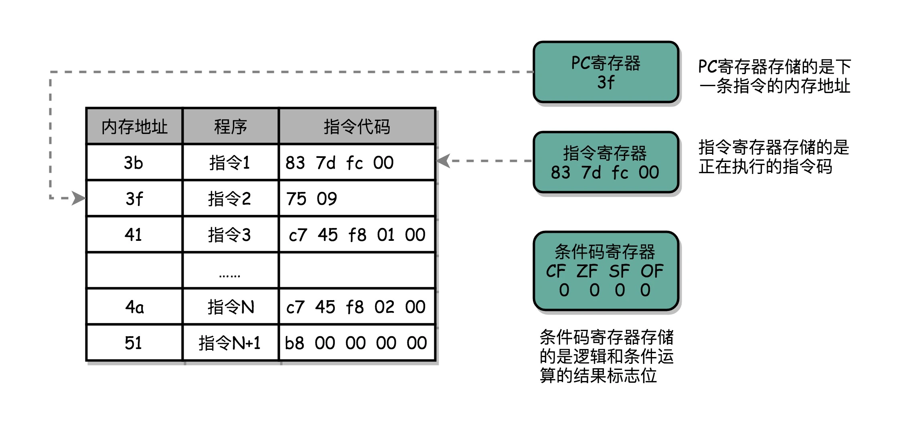
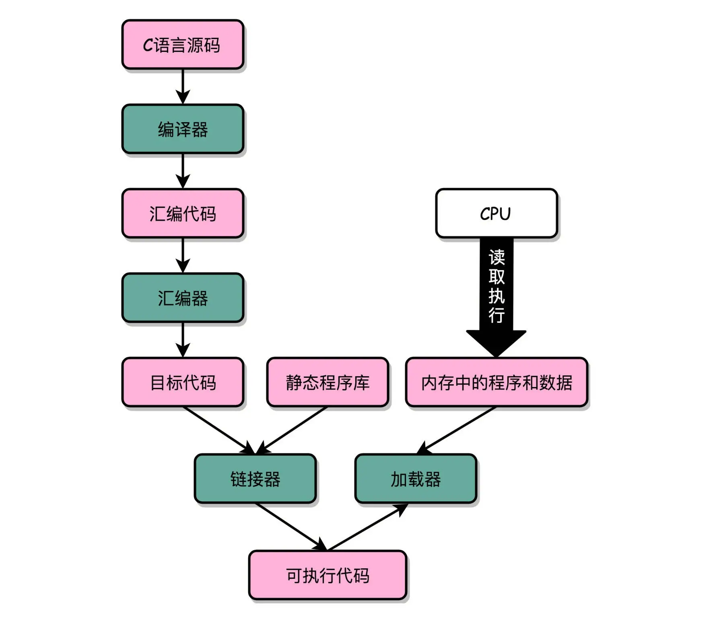
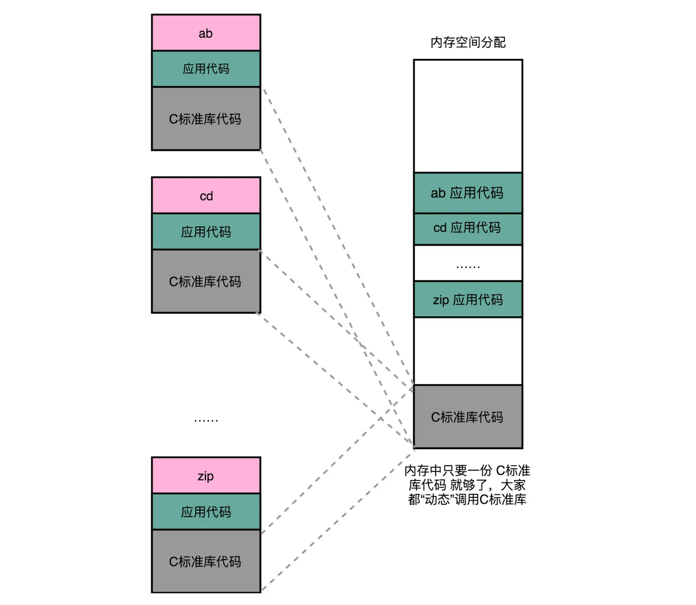

# Instruction
CPU 是执行 Instruction Code （计算机指令）的机器
我们可以把Instruction Code 叫做机器语言（Machine language）

不同CPU支持的不同，比如Intel 和AMD支持的是不同的计算机指令集

从高级语言到汇编代码，再到机器码，就是一个日常开发程序，最终变成了 CPU 可以执行的计算机指令的过程。

1. 要让程序在操作系统上跑起来，需要编译（compile）成汇编代码
> 编译-> 翻译成其他结构。
> 这里是翻译成汇编语言（ASM，Assembly Language）

2. 使用汇编器（Assmbler）翻译成机器码（Machine Code）

## 指令类型--常见
1. 算术类
   > 加减乘除
2. 数据传输类
   > 变量赋值，内存里读写数据
3. 逻辑类
   > 与或非
4. 条件分支类
   > if/else
5. 无条件跳转类
   > 比如调用函数
   

## 寄存器
1. 有些特殊寄存器
2. 还有一些普通的存储数据和内存地址的寄存器
> 存放数据的根据内容命名:  
 整数寄存器，浮点数寄存器，向量寄存器和地址寄存器等    
 数据和地址都可以放的通用寄存器

 N 个触发器或者锁存器，就可以组成一个 N 位（Bit）的寄存器，能够保存 N 位的数据。比方说，我们用的 64 位 Intel 服务器，寄存器就是 64 位的。

### 特殊的寄存器
1. PC 寄存器（Program Counter Register）
> 指令地址寄存器（Instruction Address Register）。 存放下一条需要执行的计算机指令的内存地址

2. 指令寄存器（Instruction Register）   
存放当前正在执行的指令

3. 条件码寄存器 （Status Register）  
用里面的一个一个标记位（Flag），存放CPU进行算术或者逻辑计算的结果

实际上，一个程序执行的时候，CPU 会根据 PC 寄存器里的地址，从内存里面把需要执行的指令读取到指令寄存器里面执行，然后根据指令长度自增，开始顺序读取下一条指令。可以看到，一个程序的一条条指令，在内存里面是连续保存的，也会一条条顺序加载。

跳转类指令可能会修改地址不是顺序加载

想要在硬件层面实现这个 goto 语句，除了本身需要用来保存下一条指令地址，以及当前正要执行指令的 PC 寄存器、指令寄存器外，我们只需要再增加一个条件码寄存器，来保留条件判断的状态。这样简简单单的三个寄存器，就可以实现条件判断和循环重复执行代码的功能。

## 函数内联
如果不会一直嵌套函数，编译器编译的时候会进行优化直接把这部分函数的实现接入这样就不需要跳转了。减少调用函数的出栈压栈的过程

## 编译-链接-装载： 拆解程序执行

Linux 和 Windows 上编译的不可以互相跑就是因为生成的可执行代码文件的格式不同。如果加载器可以识别对应文件就可以加载解析和运行

## 装载
第一，可执行程序加载后占用的内存空间应该是连续的  
第二，我们需要同时加载很多个程序，并且不能让程序自己规定在内存中加载的位置

分配连续的内存空间，然后对这段空间地址做一个映射

我们把指令里用到的内存地址叫作虚拟内存地址（Virtual Memory Address），实际在内存硬件里面的空间地址，我们叫物理内存地址（Physical Memory Address）。

## 内存分段和交换
1. 映射的内存根据分配给的程序分段了   
2. 当中间有程序释放了，总空间够，但是连续空间够的情况下内存交换
   > 把下面的程序先写到硬盘上然后重新加载到紧随之前程序的位置消除内存的碎片

   分段优化为分页，减小要写的程序的段的大小，这个只是重新映射（页映射）这个时候就不需要全部数据都读到内存中了。要用的时候再读就可以

## 动态链接和静态链接
1. 静态链接是把代码直接嵌入到之前的代码中
2. 动态链接是把共用代码单独存放大家共用。维护地址映射
 Windows 下的.ddl 文件 Dynamic-Link Libary（DLL，动态链接库）

Linux 下，这些共享库文件就是.so 文件，也就是 Shared Object（一般我们也称之为动态链接库）

动态代码库内部的变量和函数调用都很容易解决，我们只需要使用相对地址（Relative Address）就好了。各种指令中使用到的内存地址，给出的不是一个绝对的地址空间，而是一个相对于当前指令偏移量的内存地址。因为整个共享库是放在一段连续的虚拟内存地址中的，无论装载到哪一段地址，不同指令之间的相对地址都是不变的。