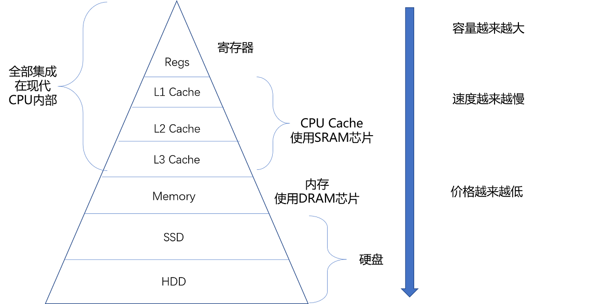
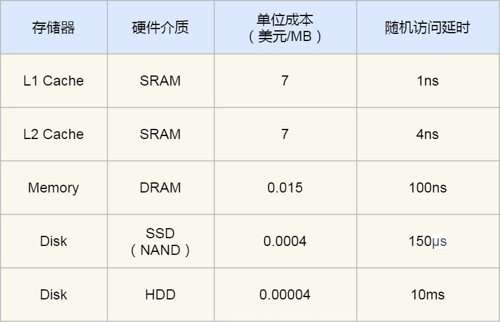
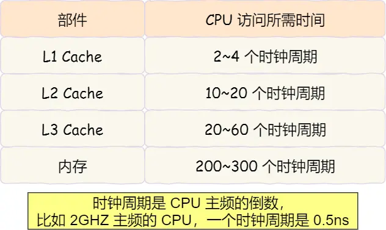
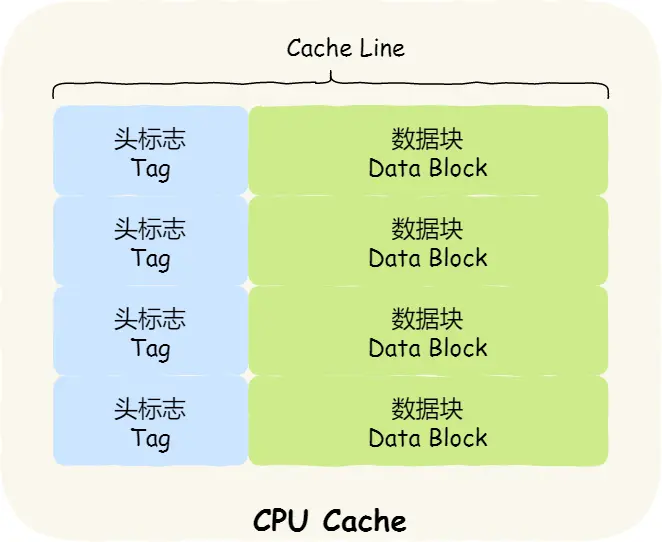

# Memory



CPU 并不是直接和每一种存储器设备打交道，而是每一种存储器设备，只和它相邻的存储设备打交道。比如，CPU Cache 是从内存里加载而来的，或者需要写回内存，并不会直接写回数据到硬盘，也不会直接从硬盘加载数据到 CPU Cache 中，而是先加载到内存，再从内存加载到 Cache 中。




## CPU寄存器(Register)
更像是CPU的一部分，只能放有限信息但是速度非常快和CPU同步。

## CPU Cache（Cpu 高速缓存）
使用 SRAM（Static Random-Access Memory，静态随机存取存储器）的芯片。

在 CPU 里，通常会有 L1、L2、L3 这样三层高速缓存。每个 CPU 核心都有一块属于自己的 L1 高速缓存，通常分成指令缓存和数据缓存，分开存放 CPU 使用的指令和数据。
> 这里是之前的结构冒险，可以让instruction 和 data 的地址不同让pipeline 不会冲突

1. L1 的缓存往往就嵌在CPU核心的内部
2. L2 也是每个CPU核心都有的，但不在内部所以会慢一点
3. L3 是多个CPU核心共用的，尺寸会更大，访问速度也更慢

```shell
# L1 cache 数据缓存容量
cat /sys/devices/system/cpu/cpu0/cache/index0/size

# L1 cache 指令缓存容量
cat /sys/devices/system/cpu/cpu0/cache/index1/size
# 查看L1 cache 数据缓存一次载入数据的大小
cat /sys/devices/system/cpu/cpu0/cache/index0/coherency_line_size
## 64字节
64

# L2 cache 缓存容量
cat /sys/devices/system/cpu/cpu0/cache/index2/size

# L3 cache 缓存容量
cat /sys/devices/system/cpu/cpu0/cache/index3/size
```
## SRAM （Static Random-Access Memory）
静态随机存取存储器
只有通电状态才保留,一般就是在Cache 里用

## DRAM （Dynamic Random Access Memory）
动态随机存取存储器
一般是在内存中用的

DRAM 被称为“动态”存储器，<font color="red">是因为 DRAM 需要靠不断地“刷新”，才能保持数据被存储起来</font>。DRAM 的一个比特，只需要一个晶体管和一个电容就能存储。所以，DRAM 在同样的物理空间下，能够存储的数据也就更多，也就是存储的“密度”更大。<font color="red">但是，因为数据是存储在电容里的，电容会不断漏电，所以需要定时刷新充电，才能保持数据不丢失</font>。DRAM 的数据访问电路和刷新电路都比 SRAM 更复杂，所以访问延时也就更长。


> DRAM 的数据访问电路和刷新电路都比 SRAM 更复杂，所以访问的速度会更慢，内存速度大概在 200~300 个 时钟周期之间。
> 
## SSD (Solid-state Disk)
SSD（Solid-state disk） 就是我们常说的固体硬盘，结构和内存类似，但是它相比内存的优点是断电后数据还是存在的，而内存、寄存器、高速缓存断电后数据都会丢失。内存的读写速度比 SSD 大概快 10~1000 倍。

> https://zh.wikipedia.org/wiki/%E5%9B%BA%E6%80%81%E7%A1%AC%E7%9B%98

## HDD （Hard Disk Drive）
机械硬盘（Hard Disk Drive, HDD），它是通过物理读写的方式来访问数据的，因此它访问速度是非常慢的，它的速度比内存慢 10W 倍左右。
> 机械硬盘工作原理比较简单。主要的两个东西，磁盘和磁针，磁盘上有很多细小的磁粉，写入数据时，给磁针通电，磁针有磁性后就可以改变磁粉的S极和N极的朝向，比如S朝上代表1，N朝上代表0.读取的时候，通过读取这些磁粉的朝向就可以读取出来记录的是0还是1.

## 速度

### 寄存器 半个时钟周期
寄存器的访问速度非常快，一般要求在半个 CPU 时钟周期内完成读写，CPU 时钟周期跟 CPU 主频息息相关，比如 2 GHz 主频的 CPU，那么它的时钟周期就是 1/2G，也就是 0.5ns（纳秒）。

### L1  2~4个周期
L1 高速缓存的访问速度几乎和寄存器一样快，通常只需要 2~4 个时钟周期，而大小在几十 KB 到几百 KB 不等。

### L2 10~20个周期
通常大小在几百 KB 到几 MB 不等，访问速度则更慢，速度在 10~20 个时钟周期。

### L3 20~60个周期
访问速度相对也比较慢一些，访问速度在 20~60个时钟周期。  
访问速度相对也比较慢一些，访问速度在 20~60个时钟周期。

### DRAM 200~300个周期
DRAM 的数据访问电路和刷新电路都比 SRAM 更复杂，所以访问的速度会更慢，内存速度大概在 200~300 个 时钟周期之间。


### SSD 200 * （10~1000）
内存的读写速度比 SSD 大概快 10~1000 倍。

### HDD 200 * (10^5)
它是通过物理读写的方式来访问数据的，因此它访问速度是非常慢的，它的速度比内存慢 10W 倍左右。


## 缓存一致性
https://www.cnblogs.com/xiaoxiongcanguan/p/13184801.html

### MESI 协议
Modified，已修改  
Exclusive，独占  
Shared，共享   
Invalidated，已失效  


### Cache Line

### MESI高速缓存一致性协议-总线嗅探
　　通常多核并行架构的CPU，每个核虽然都独自工作，但与外部存储器的交互依然是共用同一总线进行的。通过总线，每个核心都能够监听、接收到来自其它核心的消息通知，这一机制被称为总线侦听或是总线嗅探。

### 基于总线侦听的写传播：

　　每个核心在对自己独有的高速缓存行进行修改时，需要将修改通知送至总线进行广播。其它核心在监听到总线上来自其它核心的远程写通知时，需要查询本地高速缓存中是否存在同样内存位置的数据。如果存在，需要选择将其设置为失效状态或是更新为最新的值。

### 基于总线侦听的写串行化：(总线事务)

　　<font color="red"> 总线上任意时间只能出现一个核的一个写通知消息。多个核心并发的写事件会通过总线仲裁机制将其转换为串行化的写事件序列(可以简单理解为逻辑上的一个FIFO事件队列)，在每个写事件广播时，必须得到每个核心对事件的响应后，才进行下一个事件的处理，这一机制被称作总线事务。</font>

　　而本文的主角MESI协议便是基于总线侦听机制，采用回写法、写传播失效策略的高速缓存一致性协议，其另一个更精确的名称是四态缓存写回无效协议。

### 内存屏障(Memory Barrier)
　　存储缓存和失效队列的引入在提升MESI协议实现的性能同时，也带来了一些问题。由于MESI的高速缓存一致性是建立在强一致性的总线串行事务上的，而存储缓存和失效队列将事务的强一致性弱化为了最终一致性，使得在一些临界点上全局的高速缓存中的数据并不是完全一致的。

　　对于一般的缓存数据，基于异步最终一致的缓存间数据同步不是大问题。但对于并发程序，多核高速缓存间短暂的不一致将会影响共享数据的可见性，使得并发程序的正确性无法得到可靠保证，这是十分致命的。但CPU在执行指令时，缺失了太多的上下文信息，无法识别出缓存中的内存数据是否是并发程序的共享变量，是否需要舍弃性能进行强一致性的同步。

　　CPU的设计者提供了内存屏障机制将对共享变量读写的高速缓存的强一致性控制权交给了程序的编写者或者编译器。

　　内存屏障分为读屏障和写屏障两种，内存屏障以机器指令的形式进行工作。

### 写屏障
　　写屏障用于保证高速缓存间写事务的强一致性。当CPU执行写屏障指令时，必须强制等待存储缓存中的写事务全部处理完再继续执行后面的指令。相当于将存储缓存中异步处理的本地写事务做了强一致的同步。

　　写屏障指令执行完后，当前核心位于写屏障执行前的本地写事务全部处理完毕，其它的核心都已经接收到了当前所有的远程写事件的写无效通知。

### 读屏障
　　读屏障用于保证高速缓存间读事务的强一致性。当CPU执行读屏障指令时，必须先将当前处于失效队列中的写无效事务全部处理完，再继续的执行读屏障后面的指令。相当于将异步队列中异步处理的远程写事务做了强一致的同步。　

　　读屏障指令执行完后，当前核心位于读屏障执行前的远程写无效事务全部处理完毕，对于读屏障之后的共享数据读取会得到最新的值。　

　　在进行并发程序的开发时，针对关键的任务间共享变量的读写需要使用内存屏障保证其在多核间高速缓存的一致性。在对共享变量的写入指令后，加入写屏障，令新的数据立即对其它核心可见；在对共享变量的读取指令前，加入读屏障，令其能获取最新的共享变量值。

　　通过在指令中的适当位置加入读/写内存屏障，虽然一定程度上降低了效率，但保证了并发程序在多核高速缓存条件下对于共享变量的可见性，是一个很好的折中解决方案。


## 伪共享问题
因为数据是按照Cache line 读的
所以可能会导致不同的数据在一个lineA里，被A,B两个线程使用。

### 解决方案
1. 空间换时间
> 这时候可以填充使得一个cache line只有数据