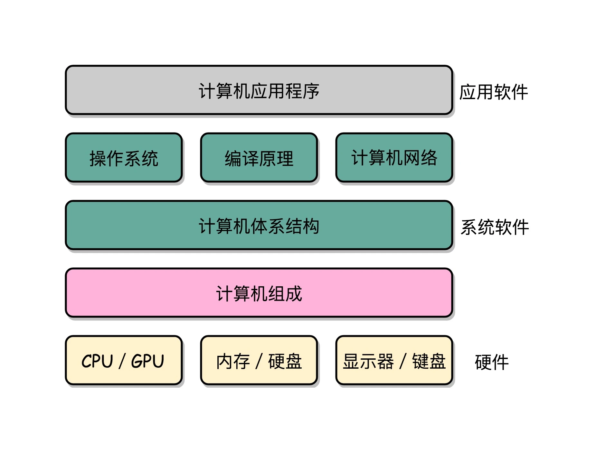
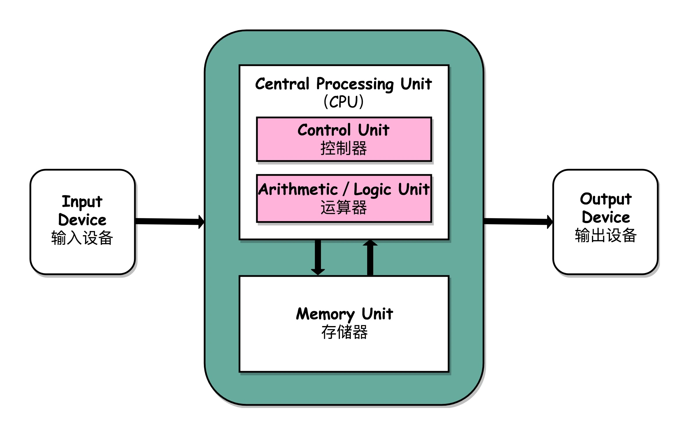
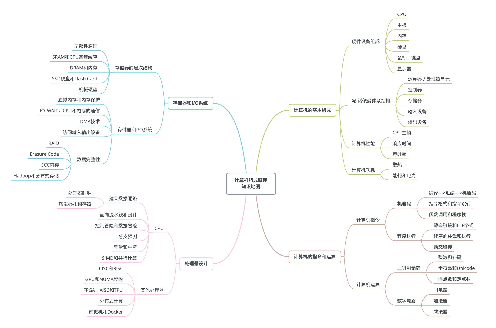
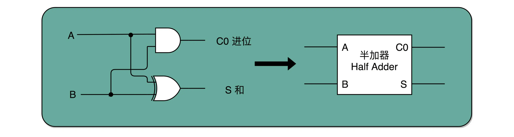
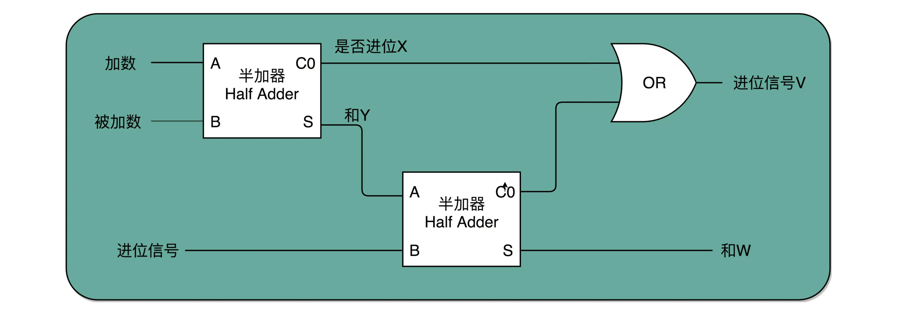
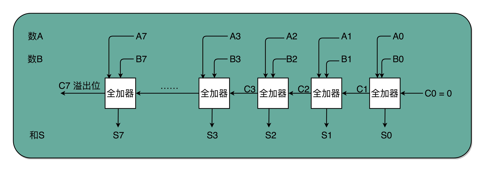
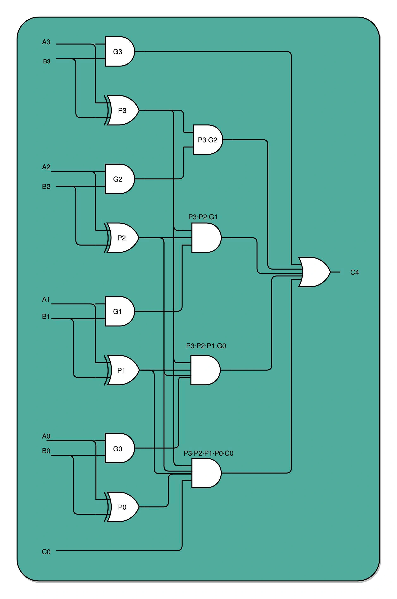
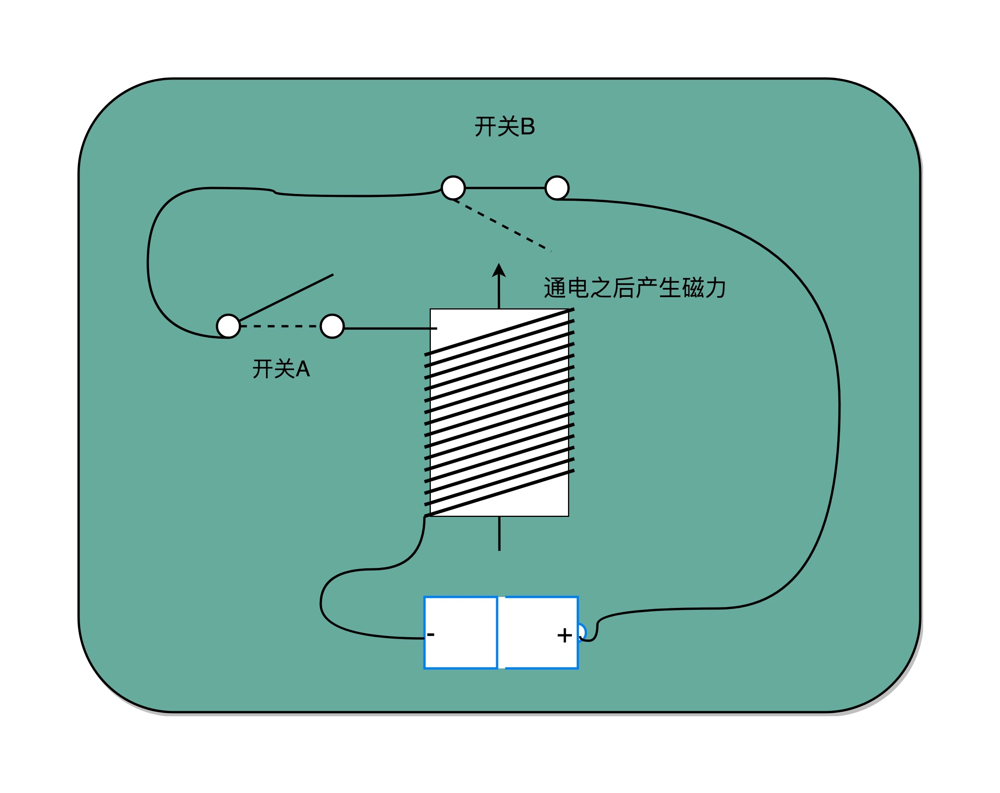
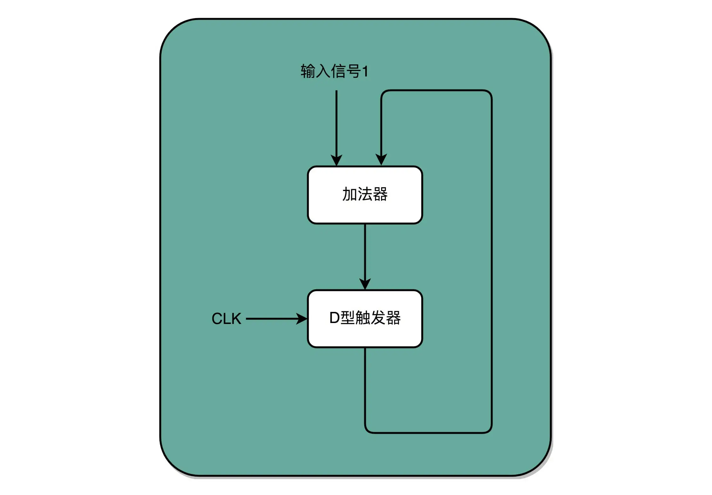

# OverView



## 组成-三大件
### CPU 中央处理器 Central Processing Unit
> CPU 一般都被叫做超大规模集成电路（very-large-scale-integration VLSI）
>
> CPU 其实就是由一堆寄存器组成的。而寄存器就是 CPU 内部，由多个触发器（Flip-Flop）或者锁存器（Latches）组成的简单电路。
>N 个触发器或者锁存器，就可以组成一个 N 位（Bit）的寄存器，能够保存 N 位的数据。比方说，我们用的 64 位 Intel 服务器，寄存器就是 64 位的。


运算器
1. 算术逻辑单元ALU（Arithmetic Logic Unit）
2. 处理器寄存器（Processor Register）

控制器
1. 指令寄存器（Instruction Register）
2. 程序计数器 (Program Counter)


### 内存 （Memory）
芯片组（Chipset） 和 总线 （bus） 解决CPU 和内存的通信问题

芯片组控制数据传输的流转，从哪里到哪里

中线是实际数据传输的高速公路。<font color="red">总线速度（Bus speed）</font> 决定数据速度


### 主板 （MotherBoard）
#### SouthBridge (南桥)
鼠标、键盘以及硬盘，这些都是插在主板上的。作为外部 I/O 设备，它们是通过主板上的南桥（SouthBridge）芯片组，来控制和 CPU 之间的通信的。“南桥”芯片的名字很直观，一方面，它在主板上的位置，通常在主板的“南面”。另一方面，它的作用就是作为“桥”，来连接鼠标、键盘以及硬盘这些外部设备和 CPU 之间的通信。

北桥已经没了。链接CPU，内存，显卡的通信，这些被移到了CPU内部

## 组成-其他
1. input 
2. output
3. electric power source(电源)
4. Graphics Card(显卡)


## 体系结构
冯·诺依曼体系结构（Von Neumann architecture），也叫存储程序计算机。

输入设备    ->  控制器、运算器  ->  
1.存储器  
2.输出设备 


### 可编程
不需要重新组装电路，不是硬件层面写死

### 可存储计算机
存储计算程序，不需要重新编写
>一个计算机程序，不可能只有一条指令，而是由成千上万条指令组成的。但是 CPU 里不能一直放着所有指令，所以计算机程序平时是存储在存储器中的。这种程序指令存储在存储器里面的计算机，我们就叫作存储程序型计算机（Stored-program Computer）。



## 知识地图



## 性能
性能 = 1/执行时间
throughput 吞吐量： 一定时间内处理多少个事情
Bandwidth 带宽 

Linux 的time 命令
real: 运行过程中流逝的时间
user：用户态运行指令的时间
sys：操作系统内核态运行指令的时间
```shell
$ time seq 1000000 | wc -l
1000000


real  0m0.101s
user  0m0.031s
sys   0m0.016s
```
> 程序实际花费的 CPU 执行时间（CPU Time），就是 user time 加上 sys time。

### 功耗
功耗 ~= 1/2 * 负载电容 * 电压的平方 * 开关评率 * 晶体管数量


### CPU计算快
1. 增加密度 减小制程 28nm -> 7 nm（在电路通讯距离一定的基础上数量多，计算就多，距离远了通信时长也变长）
2. 提升主频


### 并行提高性能（阿姆达尔定律）
多核增加吞吐量
阿姆达尔定律：
优化后的执行时间 = 受优化影响的执行时间/加速倍数 + 不受影响的执行时间。

### 加速大概率事件

### 通过流水线提高性能

### 通过预测提高性能


## CPU时钟
1. CPU Cycles 周期数  
   > 指令数 * 每条指令的平均时钟周期数
2. Clock Cycle Time 时钟周期时间
> Intel Core-i7-7700HQ 2.8GHz，这里的 2.8GHz 就是电脑的主频（Frequency/Clock Rate）。这个 2.8GHz，我们可以先粗浅地认为，CPU 在 1 秒时间内，可以执行的简单指令的数量是 2.8G 条。  <font color="red"> 1/2.8G 就是执行简单的单条指令的时间是该CPU的最小时间单位</font>
> CPU 内部的晶体振荡器（Oscillator Crystal） 晶振的一次滴答就是最小时间

因为其他硬件性能差异的影响所以只用这个参数衡量
CPU执行时间 = CPU Cycles * Clock Cycle


## 电路组成
1. 与 and  串联
2. 或 or 并联
3. 非 !  原先接通，现在不接通就断开电话

## 组合逻辑电路

### 加法器（半加和全加和加法）
11 + 01 
通过一个与门计算是否进位 1 & 1 = 1 进位   
异或门计算个位  1 ^ 1 = 0 



全加器是2个半加和一个或门
1. 上方是11 + 01 的1 + 0 的结果  X = 0， Y = 1
2. 进位信号是1位计算1 + 1 的结果 进位为1
3. 1 + Y（1）= W（0）+ 进位信号1
4. 两个进位信号or 0 + 1 = 1 所以进位
   
   11 + 01 => 100
   x = 0, w = 0, 进位 V = 1




### 加法器
多个全加器串联可以计算多位数据。这里有<font color="red">溢出位的标志</font>.
这个可以输出到硬件其他的标志位中得到结果

> 现在的都是有优化的，不是这样简单的串联的

### 乘法器
乘法变成加法+位移

1. 先拿乘数最右侧的个位乘以被乘数，然后把结果写入用来存放计算结果的开关里面，
2. 然后，把被乘数左移一位，把乘数右移一位，仍然用乘数去乘以被乘数，然后把结果加到刚才的结果上。
3. 反复重复这一步骤，直到不能再左移和右移位置。这样，乘数和被乘数就像两列相向而驶的列车，仅仅需要简单的加法器、一个可以左移一位的电路和一个右移一位的电路，就能完成整个乘法。
> 1001 * 1010
> 1. 1 * 1010 ===>  a
> 2. 0 * 10100 ===> b       a + b
> 3. 0 * 101000 ===> c      a + b + c
> 4. 1 * 1010000 ===> d     a + b + c +


### 并行加速
<font color="red">计算次数*CPU时钟=执行时间。如果计算有依赖，那么CPU必须等前置执行完成。我们可以加资源晶体管去换时间。</font>
<font color="yellow">尤其是CPU时钟频率，你有资源才能计算，当时间过了，你要等</font>

同时计算所有位数，然后在第二层去处理低位的进位逻辑。因为输入固定的时候个位和进位也是固定的。

```
具体到这里的加法，是把两个4位的二进制数相加，一个数A，从高位到低位是 A3A2A1A0，第二个数B，从高位到低位是 B3B2B1B0

我们加完之后的和，应该是 C4C3C2C1C0，变成5位，最高位的C4是代表这两个数相加之后是否会溢出一位需要进位。

不展开的情况下，我们计算C4，需要先算出A0和B0的和，以及是否进位，然后把是否进位，再和A1和B1相加，在看是否进位，这样一层层上来，这样的话，整个计算就需要至少5层（现在图里的是3层）

但是实际上我们可以把整个电路图展开，C4这个进位，只有这几种情况：

1. A3+B3 需要进位（两个都是1）
2. A3+B3是1（通过一个一个异或门）并且 A2+B2 进位。这里前面的这个就是图里第二列第一行的P3，后面是同一个节点里面的G2
3. A3+B3是1，并且 A2+B2 是1，并且 A1+B1进位。对应的就是第二列第二行的 P3，P2，G1
4. A3+B3是1，并且 A2+B2 是1，并且 A1+B1是1，并且A0+B0进位。对应的就是第二列第三行的 P3，P2，P1，G1
5. A3+B3是1，并且 A2+B2 是1，并且 A1+B1是1，并且A0+B0是1，并且下面进位上来的标志C0是1，对应的就是第二列第四行的P3，P2，P1，P0，C0

这5个结果就是图里面的第二列的电路，都是与门。然后任意一个条件满足，C4就需要进位，所以C4是这五个 与门 并联之后的 或门。
```


## 时序逻辑电路
1. 自动运行: PC寄存器自增读取下一条
2. 存储
   > 把计算结果存储在特定的电路里面，不会输入有任何改变，对应的输出也改变。
   <font color="red">储存器就可以这样存储文件</font>
3. 时序协调，使指令按顺序要求执行

### 时钟信号(CPU 时钟周期)
是时序逻辑电路的基础,通过一个磁性开关打开和关闭当前电路。
> CPU 的主频是由一个晶体振荡器来实现的，而这个晶体振荡器生成的电路信号，就是我们的时钟信号。

<font color="red">开关 A 闭合（也就是相当于接通电路之后），开关 B 就会不停地在开和关之间切换，生成对应的时钟信号</font>

### 自增
D型触发器记录结果，加法器不停+1


这样，我们就有了一个每过一个时钟周期，就能固定自增 1 的自动计数器了。这个自动计数器，可以拿来当我们的 PC 寄存器。事实上，PC 寄存器的这个 PC，英文就是 Program Counter，也就是程序计数器的意思。  
每次自增之后，我们可以去对应的 D 型触发器里面取值，这也是我们下一条需要运行指令的地址。前面第 5 讲我们讲过，同一个程序的指令应该要顺序地存放在内存里面。这里就和前面对应上了，顺序地存放指令，就是为了让我们通过程序计数器就能定时地不断执行新指令。加法计数、内存取值，乃至后面的命令执行，最终其实都是由我们一开始讲的时钟信号，来控制执行时间点和先后顺序的，这也是我们需要时序电路最核心的原因。