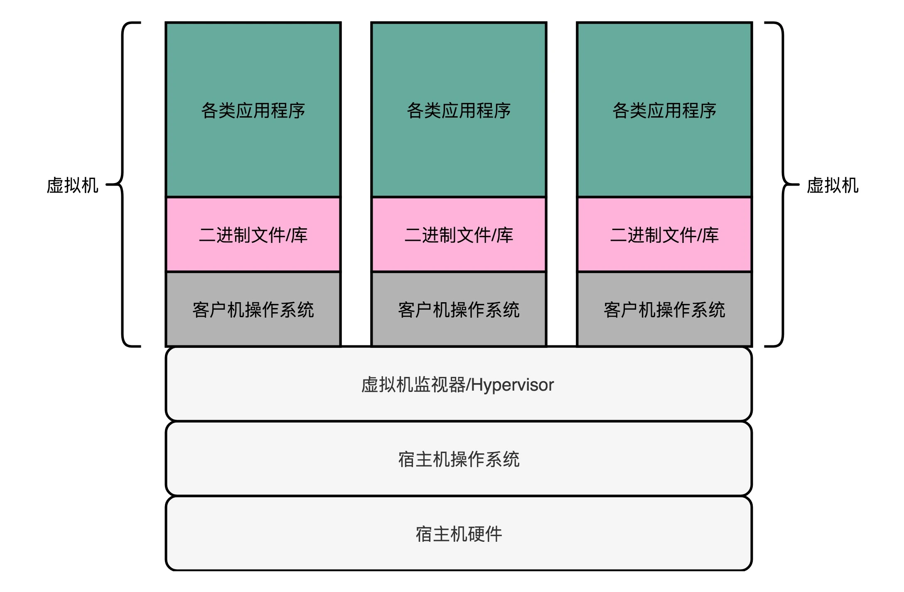
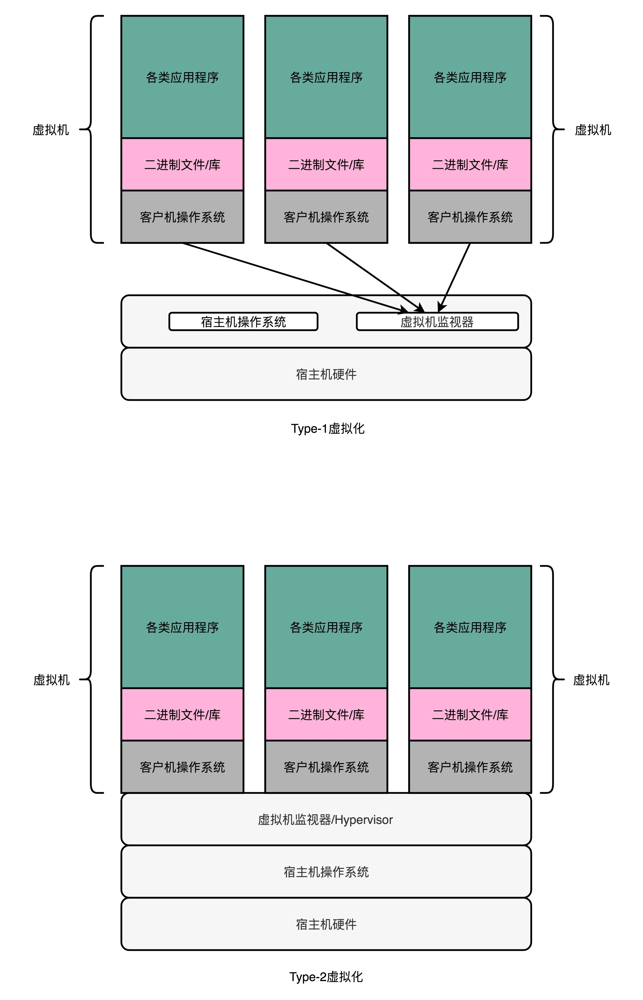
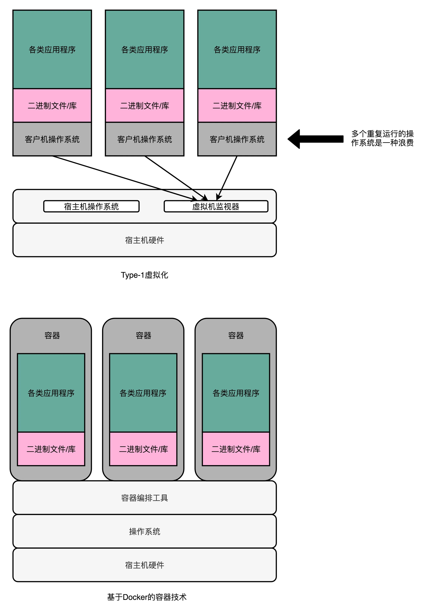

# 虚拟机（Virtual Machine）
虚拟机（Virtual Machine）技术，其实就是指在现有硬件的操作系统上，能够模拟一个计算机系统的技术。而模拟一个计算机系统，最简单的办法，其实不能算是虚拟机技术，而是一个模拟器（Emulator）

## 解释型虚拟机
要模拟一个计算机系统，最简单的办法，就是兼容这个计算机系统的指令集。我们可以开发一个应用程序，跑在我们的操作系统上。这个应用程序呢，可以识别我们想要模拟的、计算机系统的程序格式和指令，然后一条条去解释执行。

在这个过程中，我们把原先的操作系统叫作宿主机（Host），把能够有能力去模拟指令执行的软件，叫作模拟器（Emulator），而实际运行在模拟器上被“虚拟”出来的系统呢，我们叫客户机（Guest VM）。
1. 宿主机
2. 模拟器
3. 客户机  

### 优势
这种解释执行方式的最大的优势就是，模拟的系统可以跨硬件

### 缺点
1. 做不到精确模拟，有些功能可能需要依赖特殊电路
2. 解释型的性能太差，需要经过各种翻译之后才能给CPU执行

## 虚拟机监视器(Virtual Machine Manager)
### 全虚拟化技术
抛弃跨平台的能力，在同样架构的对应的物理机上去跑一个完整，不需要任何修改的客户机操作系统（Guest OS）。

我们自己做软件开发中很常用的一个解决方案，就是加入一个中间层。在虚拟机技术里面，这个中间层就叫作虚拟机监视器，英文叫 VMM（Virtual Machine Manager）或者 Hypervisor。

所有操作都是通过VMM去和宿主机交互的。

我们跑在上面的虚拟机呢，会把整个的硬件特征都映射到虚拟机环境里，这包括整个完整的 CPU 指令集、I/O 操作、中断等等。

## Type-1虚拟机--数据中心
客户机的指令交给虚拟机监视器之后呢，不再需要通过宿主机的操作系统，才能调用硬件，而是可以直接由虚拟机监视器去调用硬件。
>在数据中心里面，我们并不需要在 Intel x86 上面去跑一个 ARM 的程序，而是直接在 x86 上虚拟一个 x86 硬件的计算机和操作系统。所以，我们的指令不需要做什么翻译工作，可以直接往下传递执行就好了，所以指令的执行效率也会很高。

## Type-2虚拟机--个人日常电脑
在 Type-2 虚拟机里，我们上面说的虚拟机监视器好像一个运行在操作系统上的软件。你的客户机的操作系统呢，把最终到硬件的所有指令，都发送给虚拟机监视器。而虚拟机监视器，又会把这些指令再交给宿主机的操作系统去执行。

我们只是把在模拟器里的指令翻译工作，挪到了虚拟机监视器里。没错，Type-2 型的虚拟机，更多是用在我们日常的个人电脑里，而不是用在数据中心里。

## docker 容器化资源隔离，节约type1里的客户机操作系统的重复资源
多运行一个操作系统，意味着我们要多消耗一些资源在 CPU、内存乃至磁盘空间上。

因为我们想要的未必是一个完整的、独立的、全虚拟化的虚拟机。我们很多时候想要租用的不是“独立服务器”，而是独立的计算资源。在服务器领域，我们开发的程序都是跑在 Linux 上的。其实我们并不需要一个独立的操作系统，只要一个能够进行资源和环境隔离的“独立空间”就好了。

