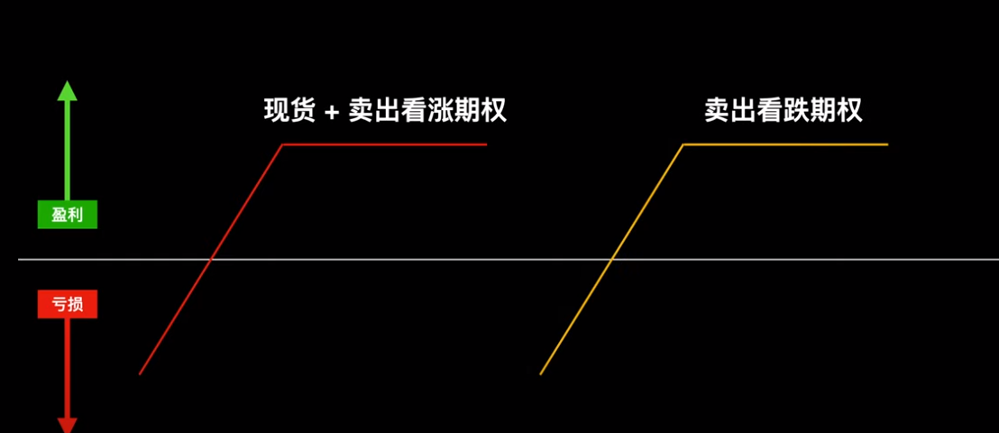
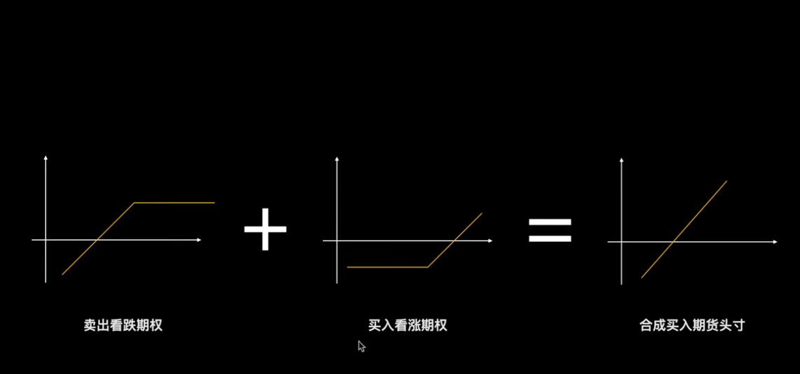
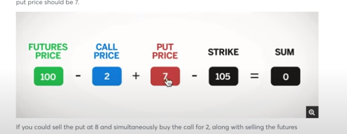

# Option 期权

> ***注意尽量不要把期权留到最后,不要裸卖期权***
> 
> Theta 在最后一个月掉的最快。外在价值/时间价值掉的很快
> 隐含波动率低适合买期权
> 隐含波动率高适合卖期权

# 内在价值和外在价值

# 备兑看涨
买入现货+卖出看涨期权

币价涨了是收益固定，币价跌了是浮亏，可以等现货涨回来 

# 卖出看跌期权
https://www.youtube.com/watch?v=LB6ettLgCCs&list=PLMLs3rAzvwDPQlQzmU8lmMhB1PoBJfBMK&index=8

损益图和备兑看涨一样，但是有区别
> 币价上涨
>> 1. 未过行权价时，备兑看涨收益多，因为包含持币收益
>> 2. 超过行权价，都一样
> 
> 币价下跌  
>> 1. 备兑看涨，现货浮亏
>> 2. 卖看跌期权，亏损加剧，占用保证金。有被行权风险

***买入期货+卖出看涨期权 = 卖出看跌期权***
以上两者情况就没有了现货的特点

# Put-Call Parity 期权平价公式
https://www.youtube.com/watch?v=jKpzxS_kWbk&list=PLMLs3rAzvwDPQlQzmU8lmMhB1PoBJfBMK

> 看涨期权和看跌期权的行权价和行权日要一致才可以   

买入现货/期货 = 卖出看跌期权 + 买入看涨期权   
卖出看跌期权  = 买入现货/期货 - 买入看涨期权 = 买入现货/期货 + 卖出看涨期权

如果公式不等于0就可以套利sum 就是你的收益

> 如果流动性不够，不能平仓，可以用这个公式去计算操作买入期权卖出期权等进行平仓
>

买入现货/期货 = 卖出看跌期权 + 买入看涨期权 ==>
买入期货 - 买入看涨期权 - 卖出看跌 = 0
买入期货 - 买入看涨期权 + 买入看跌 = 0

买入期货 - 买入看涨期权 + 买入看跌期权 - 行权价 = 0     
期货和看跌期权

等式变化===>
期货价格  + 看跌期权 = 行权价 + 卖出看涨期权
<!-- 到期买入这个价格的现货  + 看跌期权 -->

